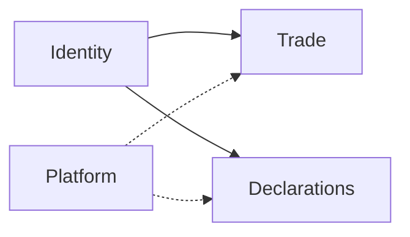

# Feed Farm Trade — architecture

**SSOT:** [doc/frontend/adr/001A-feed-farm-trade-architecture.md](../../../doc/frontend/adr/001A-feed-farm-trade-architecture.md)

Agent one-screen (detail lives in 001A):



**Hard rule:** Trade ↛ Declarations (and reverse). Compose at adapter if both needed.

| Layer | Name |
|-------|------|
| UI / nav / FE docs | **Feed Farm Trade** |
| Flags / ops ADRs / domain slang | **Hot Sales** (`HOT_SALES_*`) |

```text
app/trade/**/page.tsx → features/trade/* → app/actions/trade.ts → modules/trade/domain/*
layout: requireTradeAccess + AdminCnShell only
```

| Concern | Path |
|---------|------|
| Layout gate | `app/trade/layout.tsx` |
| Entitlement | `modules/platform/shell/access.ts` |
| Permissions | `modules/trade/domain/rbac-catalog.ts` |
| Session | `modules/trade/auth/trade-session.ts` |
| Store | `modules/trade/domain/store.ts` |
| Actions | `app/actions/trade.ts` |
| UI locale arg | `features/trade/trade-ui-locale.ts` |
| Ops SSOT | `docs/hot-sales/RUNTIME.md` · gate-register |

**Dead residue:** `/trade/[locale]`, `TradeShell`, locale switcher — do not remount.

**Coding:** use [slice-playbook.md](slice-playbook.md) · [action-map.md](action-map.md) · [example-slice.md](example-slice.md).
