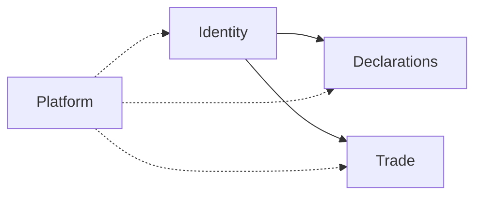

# Bounded contexts

Modules inside the monolith. Dependencies are **one-way** and minimal.

## Context map

| Context          | Owns                                                                                         | Code today (see [06-lib-ownership.md](06-lib-ownership.md)) | May depend on               | Must not depend on  |
| ---------------- | -------------------------------------------------------------------------------------------- | ----------------------------------------------------------- | --------------------------- | ------------------- |
| **Identity**     | Session, org membership, invites, account                                                    | `modules/identity/**` | Neon Auth                   | Declarations, Trade |
| **Declarations** | Surveys/declarations, questions, clients list, assignments, submissions, share links, drafts | `modules/declarations/**` | Identity (actor / org ids)  | Trade               |
| **Trade**        | Events, orders, allocation, deposits, pickup, imports, ERP sync, RBAC (product: **Feed Farm Trade**) | `modules/trade/**`, `app/actions/trade`, `features/trade`, `app/trade` | Identity (allowlist / RBAC) | **Declarations**    |
| **Platform**     | Health, env, observability, shared API error helpers                                         | `modules/platform/**`, `app/api/health/*` | nothing product-specific | —                   |

**Target folders:** `modules/{platform,identity,declarations,trade}/` — `lib/` is transitional. Full path map: [06-lib-ownership.md](06-lib-ownership.md).

## Hard rules

1. **Trade ↛ Declarations** (and reverse). No imports across those domain trees.  
2. Shared primitives only: `lib/schemas/common` (until Platform owns shared Zod), branded IDs, env utilities.  
3. New feature → pick **one** context; if it needs both Trade and Declarations data, compose at the **adapter** (page/action) by calling two ports — do not merge domains.  
4. Schema/migrations: prefer table prefixes or clear ownership comments per context when adding tables.
5. Do not grow `lib/pages` / `lib/entry` for greenfield UI — use `features/*`.

## Scaling path (later, needs new ADR)

- Extract Trade to a separate deployable only when team/ops cost of a monolith exceeds benefit.  
- Until then: modular folders + import bans (lint/check) beat network splits.  

## Related

- [06-lib-ownership.md](06-lib-ownership.md) — full `lib/` → `modules/` inventory  
- [03-ports-and-adapters.md](03-ports-and-adapters.md)  
- [adr/001-modular-monolith-hexagonal.md](adr/001-modular-monolith-hexagonal.md)  
- [../frontend/adr/001A-feed-farm-trade-architecture.md](../frontend/adr/001A-feed-farm-trade-architecture.md) — Trade product architecture (Feed Farm Trade)  
