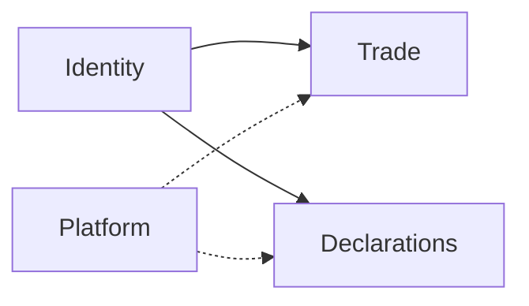

# Frontend ADR-001A — Feed Farm Trade architecture

| Field | Value |
|-------|-------|
| **Status** | Accepted |
| **Date** | 2026-07-11 |
| **Mode** | Architecture (structure + boundaries) |
| **Audience** | Engineers + agents implementing `/trade` |
| **Decision locks** | [001-feed-farm-trade.md](001-feed-farm-trade.md) |
| **Roadmap / MVP** | [001R-feed-farm-trade-roadmap.md](001R-feed-farm-trade-roadmap.md) |
| **Agent skill** | [`.cursor/skills/feed-farm-trade`](../../../.cursor/skills/feed-farm-trade/SKILL.md) |

```text
LOAD: context map, folders, request flow, naming, failure modes
SKIP: product locks → 001 · phase AC / gap IDs → 001R
```

---

## Context

Feed Farm Trade is the **product** module for B2B feed & farm trade sales. The **engine** remains Hot Sales (`HOT_SALES_*`, `docs/hot-sales/`). UI must share the portal AdminCN shell and stay locale-free under `/trade/*`.

This document records the durable structure after the Phase A+B gap-close (skill pack + AdminCN P1 wire). It does not reopen Hot Sales 2B–2D flag promotion.

## Responsibilities and boundaries



| Boundary | Rule |
|----------|------|
| Trade ↛ Declarations | No domain imports either direction; compose at adapter if both needed |
| Product vs engine | UI/nav = **Feed Farm Trade**; flags/ops ADRs/domain slang = **Hot Sales** |
| Shell entitlement | `feed-farm-trade` via `requireTradeAccess` — org admin alone does not grant |
| Chrome | `AdminCnShell` only — never `TradeShell` or locale switcher |
| Paths | Locale-free `/trade/**` — no live `app/trade/[locale]` |

## Components

| Layer | Path | Responsibility |
|-------|------|----------------|
| Routes | `app/trade/**` | Thin RSC: await `params`; compose only |
| Layout | `app/trade/layout.tsx` | `requireTradeAccess` + `AdminCnShell` |
| UI | `features/trade/*` | Forms/panels; no shell chrome |
| Actions | `app/actions/trade.ts` | Zod + session/permission → domain → `ActionResult` |
| Domain | `modules/trade/**` | SQL, allocation rules, RBAC codes |
| Entitlement | `modules/platform/shell/access.ts` | Nav module visibility |
| Session | `modules/trade/auth/trade-session.ts` | Trade access resolution |
| Nav | `components-V2/platform-config/navConfig.tsx` | `moduleId: feed-farm-trade` |
| Ops SSOT | `docs/hot-sales/` | RUNTIME, gate-register, engine ADRs |
| REST contract | `doc/api/02-rest-resources.md` | Locale-free `/api/trade/...` — contract-only |

### Trusted files

| Concern | Path |
|---------|------|
| Layout gate | `app/trade/layout.tsx` |
| Entitlement | `modules/platform/shell/access.ts` |
| Session | `modules/trade/auth/trade-session.ts` |
| Permissions | `modules/trade/domain/rbac-catalog.ts` |
| Store / rules | `modules/trade/domain/store.ts` |
| Actions | `app/actions/trade.ts` |
| Default UI locale arg | `features/trade/trade-ui-locale.ts` (`TRADE_UI_LOCALE`) |
| Routes helpers | `modules/platform/routing/portal-routes.ts` · `modules/trade/i18n/trade.ts` (`tradeHref`) |

## Data / request flow

```text
app/trade/**/page.tsx          → thin RSC (params await; no business logic)
  → features/trade/*           → UI (NO TradeShell / locale switcher)
  → app/actions/trade.ts       → Zod + requireTradeAccess / permission
  → modules/trade/domain/*     → SQL / rules
layout: requireTradeAccess + AdminCnShell only
```

| Need | Path |
|------|------|
| RSC read | Call `modules/trade` domain directly — never fetch own `/api/trade` |
| Client mutation | Server Action `trade.ts` → Zod → session/perm → domain → `ActionResult` |
| External HTTP | Route Handler per `doc/api` — contract-only until a consumer needs it |

**Locale note:** Actions still accept a `TradeLocale` argument for copy/domain i18n. URL paths are locale-free; pages pass `TRADE_UI_LOCALE` from `features/trade/trade-ui-locale.ts`.

## Key decisions

| Decision | Rationale |
|----------|-----------|
| AdminCN only | One SaaS shell with Declarations / Account |
| Kill `/trade/[locale]` + TradeShell | Residue fought platform shell; i18n deferred to action arg |
| Actions-first UI | Matches portal BFF decision tree; REST stays contract-only |
| Keep `HOT_SALES_*` | Gate-register and prod ops already keyed to those names |
| Permission codes, not role names | Stable RBAC; see `rbac-catalog.ts` |

## Failure modes

| Failure | Expected behavior |
|---------|-------------------|
| No session on `/trade` | Sign-in redirect (proxy + layout) |
| Session without trade permission | Denied; FFT nav hidden |
| Org admin without trade allowlist/RBAC | Declarations OK; `/trade` denied |
| P3 ops flags off | Deposits/pickup/imports/ERP writes blocked; P1 cycle still works |
| Missing permission on mutation | Action returns deny / error — never silent success |

## Operational considerations

- **P3 promotion:** flags + [gate-register](../../../docs/hot-sales/ops/gate-register.md) only — do not invent checklists in FE ADRs.
- **G0:** `docs/hot-sales/` is present (restored). Cite RUNTIME / gate-register as living authority.
- **Verify slice:** `requireTradeAccess` / permission · Zod at action edge · no TradeShell · update [completeness.md](../../../.cursor/skills/feed-farm-trade/completeness.md) when status changes.
- **Engine lane:** Hot Sales 2B–2D product UI / flag work still requires gate-register + explicit reopen — this architecture doc does not reopen them.

## Known limits / future changes

| Limit | Notes |
|-------|-------|
| P2 UI polish | Closed until explicit reopen — thin AdminCN pages are MVP-OK |
| P3 ops surfaces | Placeholder / flag-gated pages under `/trade/admin/...` |
| Customer portal | Later series branch — wrong actor for this module |
| `HOT_SALES_*` / `/trade` rename | Requires new ADR + migration |
| Full e2e AC journey | Recommended before claiming enterprise MVP (see 001R DoD) |

## Related

- [001-feed-farm-trade.md](001-feed-farm-trade.md) — locks
- [001R-feed-farm-trade-roadmap.md](001R-feed-farm-trade-roadmap.md) — P0–P3 + gaps
- [../01-architecture.md](../01-architecture.md) — portal FE layers
- [../03-routes.md](../03-routes.md) — route table
- [../../backend/02-bounded-contexts.md](../../backend/02-bounded-contexts.md) — Trade context
- [docs/hot-sales/architecture/s19-trade-slice.md](../../../docs/hot-sales/architecture/s19-trade-slice.md) — Phase 1 engine slice (historical)
