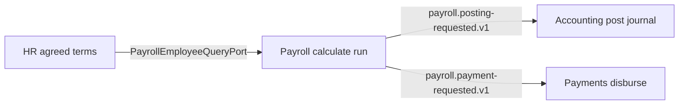

# Allowance and deduction ownership (HR Slice 8.6)

**Authority:** Single authoritative four-way ownership statement for monetary allowances and payroll deductions across Human Resources, Payroll, Accounting, and Payments.

**Program:** [00.hrm.md](../00.hrm.md) Phase 8 · Slice 8.6 **DONE**

**Related (not in scope here):** Slice 8.7 payroll handoff contract · Slice 8.8 HR→payroll parsing parity

---

## Four-way ownership

| Layer | Package | Owns | Does not own |
|-------|---------|------|--------------|
| **Entitlement / agreement** | `@afenda/human-resources` | What the company agreed to pay or enroll — compensation agreements, allowance entitlements, bonus eligibility, benefit enrollment **contribution terms** | Pay-period calculated amounts; gross-to-net; journals; payments |
| **Calculation** | `@afenda/payroll` | Pay-period earnings, deductions, statutory results, gross pay, net pay, payslips, reconciliation | Any `hr_*` writes; `journal*`; `payment*` |
| **Posting** | `@afenda/accounting` | GL journals, ledger postings, source posting links via `postFinancialSourceEvent` / posting profiles | Payroll calculation; payment execution |
| **Disbursement** | `@afenda/payments` | Money movement — `payment`, `payment_allocation`, `payment_account`, `payment_reversal` | Payroll calculation; journal creation |

**Slice 8.6 bullets (normative):**

1. HR owns entitlement or agreement.
2. Payroll owns calculation.
3. Accounting owns posting.
4. Payments owns disbursement.

---

## Allowance path

| Stage | Owner | Tables / artifacts | Write surface |
|-------|-------|-------------------|---------------|
| Agreement | `@afenda/human-resources` | `hr_allowance_entitlement`, `hr_employee_compensation` (base + components) | `packages/erp/human-resources/src/mutation-tables.ts` |
| Calculation | `@afenda/payroll` | `payroll_earning_rule`, `payroll_recurring_earning`, `payroll_result_line` (earning lines), `payroll_run`, `payroll_payslip` | `packages/erp/payroll/src/mutation-tables.ts` |
| Posting | `@afenda/accounting` | `journal`, `journal_line`, `ledger_posting`, `source_posting_link` | `packages/erp/accounting/src/module.manifest.ts` |
| Disbursement | `@afenda/payments` | `payment`, `payment_allocation`, `payment_account`, `payment_reversal` | `packages/erp/payments/src/module.manifest.ts` |

---

## Deduction path

| Stage | Owner | Tables / artifacts | Write surface |
|-------|-------|-------------------|---------------|
| Agreement | `@afenda/human-resources` | Benefit enrollment **contribution terms** on `hr_benefit_enrollment` (`employeeContributionAmount`, `employerContributionAmount`, `contributionFrequency`) — agreed plan terms, not period-calculated amounts | `packages/erp/human-resources/src/mutation-tables.ts` |
| Calculation | `@afenda/payroll` | `payroll_deduction_rule`, `payroll_recurring_deduction`, `payroll_statutory_rule`, `payroll_statutory_result`, `payroll_result_line` (deduction lines), gross-to-net on run | `packages/erp/payroll/src/mutation-tables.ts` |
| Posting | `@afenda/accounting` | Liability/expense journals from payroll posting profile | Same as allowance posting |
| Disbursement | `@afenda/payments` | Net-pay disbursement (`direction = disbursement`) from finalized payroll | Same as allowance disbursement |

---

## Integration chain

Payroll consumes HR facts through `PayrollEmployeeQueryPort` at the `apps/web` composition root — not via peer package imports.



| Event | Producer | Consumer | Meaning |
|-------|----------|----------|---------|
| `payroll.posting-requested.v1` | `@afenda/payroll` | `@afenda/accounting` (app-saga) | Request to create and post journals — **not** journal ownership |
| `payroll.payment-requested.v1` | `@afenda/payroll` | `@afenda/payments` (app-saga) | Request to create disbursement instructions — **not** payment ownership |

Payroll `payment_instruction` and `accounting_posting` aggregates are **logical event-saga markers** in `PAYROLL_AGGREGATES`; they are **not** mutation tables and do not transfer write ownership to Payroll.

---

## Worked example

```text
Human Resources
  Employee base salary = RM8,000
  Transport allowance entitlement = RM500
  Medical plan = Plan A
  Employee contribution = 10% (enrollment term)
        ↓
  approved compensation snapshot / port
        ↓
Payroll
  July basic earning = RM8,000
  July transport earning = RM500
  July employee contribution = calculated amount
  July statutory deduction = calculated amount
  July net pay = calculated amount
        ↓
Accounting
  payroll.posting-requested.v1 → journal posted (expense / liability)
        ↓
Payments
  payroll.payment-requested.v1 → disbursement payment posted
```

HR must not calculate gross-to-net payroll. Payroll must not silently change employment compensation agreements. Payroll must not insert into `journal*` or `payment*`. Accounting and Payments must not write `hr_*` or `payroll_*` tables.

---

## Homonym disambiguation

| Term in codebase | Meaning | Owner |
|------------------|---------|-------|
| `hr_allowance_entitlement` | Monetary allowance agreement | `@afenda/human-resources` |
| `hr_leave_entitlement` | Leave quantity ledger (days/hours) | `@afenda/human-resources` — not Slice 8.6 money path |
| `automaticBreakMinutes` / break `deductionMinutes` | Attendance time policy | `@afenda/human-resources` time — not payroll deduction |
| `grossMinutes` | Worked minutes on attendance session | `@afenda/human-resources` time — not gross pay |
| `payroll_deduction_rule` / `payroll_recurring_deduction` | Calculated pay-period deduction setup and results | `@afenda/payroll` |
| `employeeContributionAmount` on `hr_benefit_enrollment` | Agreed plan contribution term | `@afenda/human-resources` |
| Employee contribution on `payroll_result_line` / payslip | Period-calculated deduction | `@afenda/payroll` |

---

## Anti-patterns (forbidden)

| Anti-pattern | Why |
|--------------|-----|
| Gross-to-net or pay-period deduction math in `@afenda/human-resources` | Calculation is Payroll sole mutator |
| Payroll inserting/updating `hr_employee_compensation` or `hr_allowance_entitlement` | Agreement is HR sole mutator |
| Payroll inserting `journal` / `journal_line` / `payment` directly | Posting and disbursement are peer owners |
| Accounting or Payments writing `payroll_*` or `hr_*` | Violates sole-mutator manifest |
| Treating `payroll.payment-requested.v1` as proof Payments ownership of payroll calculation | Event is a **request**; Payments owns execution only |

---

## Schema ownership register

Authoritative write owners: [SCHEMA-OWNERSHIP-MANIFEST.yaml](../../modules/SCHEMA-OWNERSHIP-MANIFEST.yaml)

Key rows:

| Table | writeOwner |
|-------|------------|
| `hr_allowance_entitlement` | `@afenda/human-resources` |
| `hr_employee_compensation` | `@afenda/human-resources` |
| `hr_benefit_enrollment` | `@afenda/human-resources` |
| `payroll_deduction_rule` | `@afenda/payroll` |
| `payroll_recurring_deduction` | `@afenda/payroll` |
| `payroll_result_line` | `@afenda/payroll` |
| `journal` / `journal_line` / `ledger_posting` | `@afenda/accounting` |
| `payment` / `payment_allocation` | `@afenda/payments` |

---

## Residual (not blocking Slice 8.6)

- `hr_allowance_entitlement` — schema and mutation registration present; domain commands ship in a later slice.
- Slice **8.7** — shared handoff contract (fields, parser) not yet published.
- Slice **8.8** — HR→payroll decimal and effective-date parity tests not yet green.
- Finalization app-sagas for `payroll.posting-requested.v1` / `payroll.payment-requested.v1` may be incomplete in product wiring; ownership boundaries above still hold.

---

## Cross-references

| Surface | Link |
|---------|------|
| HR ↔ payroll boundary prose | [human-resource.md](./human-resource.md) §3 · §7 |
| Package READMEs | `packages/erp/{human-resources,payroll,accounting,payments}/README.md` |
| ERP boundaries index | [packages/erp/README.md](../../packages/erp/README.md) |
| Payroll skill boundaries | `.cursor/skills/afenda-elite-payroll/boundaries.md` |
