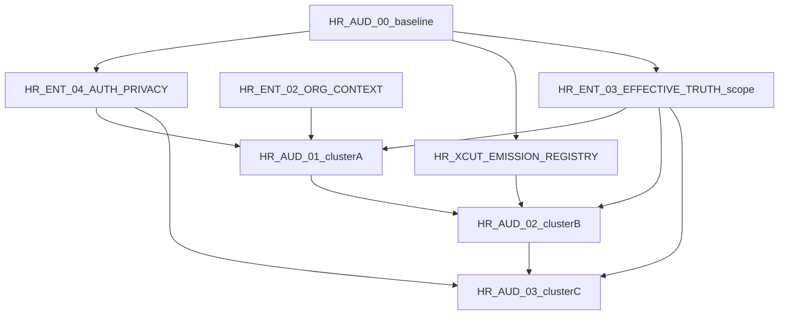

# HR-AUD-00 — Cross-cutting conflicts and repair readiness

| Field | Value |
|---|---|
| Mission | **HR-AUD-00** |
| Purpose | Separate **architecture decisions** from **implementation defects**; define repair ordering |

Related: [`01-cross-cutting-baseline.md`](01-cross-cutting-baseline.md) · [`02-canonical-definitions.tsv`](02-canonical-definitions.tsv)

---

## Architecture decisions (require explicit approval)

These are not bugs — they are fork points where repository evidence does not pick a single owner.

### OPEN-DECISION-01 — Effective-truth scope

| Aspect | Detail |
|---|---|
| **Conflict** | HR-ENT-05 language ("package-wide") vs `HUMAN_RESOURCES_EFFECTIVE_TRUTH_EXPECTED_TABLES` (33 tables) |
| **Options** | A) Expand matrix to cover all mutable `hr_*` tables incrementally B) Publish explicit exclusion register for operational/event tables |
| **Canonical recommendation** | B short-term (document exclusions), A long-term via domain-cluster audits |
| **Blocking** | HR-ENT-05 formal closure |
| **Owner mission** | HR-ENT-03-EFFECTIVE-TRUTH + HR-AUD-01/02/03 |

### OPEN-DECISION-02 — Authorization layering model

| Aspect | Detail |
|---|---|
| **Conflict** | Four entry points: manifest permission, resource-aware port, contextual policies, ER case-access |
| **Options** | A) Single facade (`contextual-authorization`) with ER plugin B) Document intentional layers with mandatory coverage test |
| **Canonical recommendation** | A for HR-ENT-06 compliance |
| **Blocking** | HR-ENT-06 |
| **Owner mission** | HR-ENT-04-AUTH-PRIVACY |

### OPEN-DECISION-03 — Privacy / DSAR execution owner

| Aspect | Detail |
|---|---|
| **Conflict** | `HumanResourcesPrivacyPort` in HR package vs platform DSAR infrastructure |
| **Options** | A) Platform service + apps/web adapter B) HR-internal port with platform audit only |
| **Canonical recommendation** | A per enterprise.md Phase 4/5 platform boundary |
| **Blocking** | HR-ENT-07 |
| **Owner mission** | HR-ENT-04-AUTH-PRIVACY + platform mission group |

### OPEN-DECISION-04 — Organization dimension directory owner

| Aspect | Detail |
|---|---|
| **Conflict** | `OrganizationDimensionDirectoryPort` typed in HR; `@afenda/master-data` may not expose all dimension kinds |
| **Options** | A) Extend master-data B) HR-owned dimension snapshot tables only C) Hybrid |
| **Canonical recommendation** | C — governed keys in master-data, snapshots on assignments (already partially on disk) |
| **Blocking** | HR-ENT-04 |
| **Owner mission** | HR-ENT-02-ORG-CONTEXT · HR-AUD-01 |

### OPEN-DECISION-05 — Payroll money handoff scale

| Aspect | Detail |
|---|---|
| **Conflict** | HR decimal strings vs payroll calculation input conventions |
| **Canonical recommendation** | Document shared handoff schema in ERP boundary scratch (`human-resource.md`) |
| **Blocking** | Compensation/time payroll integration |
| **Owner mission** | HR-AUD-03 + `@afenda/payroll` |

---

## Implementation defects (disk-confirmed)

| ID | Defect | Severity | Owner mission |
|---|---|---|---|
| HR-XCUT-P0-003 | Emission registry covers 88/286 commands | P0 | HR-XCUT-EMISSION-REGISTRY |
| HR-XCUT-P0-004 | Privacy port not composed or called | P0 | HR-ENT-04-AUTH-PRIVACY |
| HR-XCUT-P1-003 | enterprise.md stale command/query counts | P1 | Scratch doc refresh |
| HR-XCUT-P1-010 | HR-00 audit contradicts disk | P1 | Supersede pointer (HR-AUD-00 done) |

---

## Dependency ordering (repair graph)



**Interpretation:**

1. Cross-cut baseline (complete) informs all tracks.
2. **Authorization + privacy** unblocks cluster A and C sensitive domains.
3. **Org context** unblocks cluster A historical semantics (HR-ENT-04).
4. **Emission registry** unblocks cluster B event/audit parity.
5. **Effective-truth scope decision** unblocks per-domain temporal audits.

---

## Likely first P0/P1 repair missions (names only)

| Priority | Mission name | Rationale |
|---|---|---|
| P0 | **HR-ENT-04-AUTH-PRIVACY** | Unifies authorization; wires privacy port — closes HR-ENT-06/07 cross-cut gaps |
| P0 | **HR-XCUT-EMISSION-REGISTRY** | Complete command→emission map; enables correlation CI for all mutations |
| P1 | **HR-ENT-02-ORG-CONTEXT** | Deterministic org dimensions — enterprise blocker cited in enterprise.md |
| P1 | **Scratch doc refresh** | Align enterprise.md counts with disk/registers |

**Do not start product repair in HR-AUD-00.** Domain depth belongs in HR-AUD-01/02/03 findings first.

---

## Separated concerns checklist

| Concern | Architecture decision | Implementation defect |
|---|---|---|
| Effective truth breadth | OPEN-DECISION-01 | Matrix validator works for scoped set |
| Authorization model | OPEN-DECISION-02 | ER case-access not integrated with contextual facade |
| Privacy execution | OPEN-DECISION-03 | Port exists but unwired |
| Org dimensions | OPEN-DECISION-04 | Port wired in apps/web; master-data completeness TBD |
| Payroll money | OPEN-DECISION-05 | HR decimal schema consistent internally |
| Event emission | — | Registry incomplete (P0-003) |
| Doc authority | — | HR-00 superseded; enterprise count drift |

---

## Verification commands (read-only, for closure tracking)

```bash
# Cross-cut inventory sanity (no mutations)
pnpm --filter @afenda/human-resources typecheck
pnpm --filter @afenda/human-resources test -- effective-truth-adoption memory-coverage drizzle-coverage contextual-authorization-privacy

# Register parity (may report unrelated drift — record only)
pnpm validate:modules

# Tenancy SSOT
pnpm audit:tenancy-nulls
```

Domain-cluster audits add parity and domain suites on top of this baseline.
