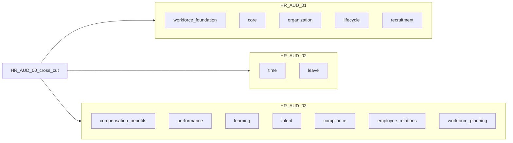

# HR-AUD-00 — Domain-cluster audit contract

| Field | Value |
|---|---|
| Mission | **HR-AUD-00** (defines contract) |
| Consumers | **HR-AUD-01**, **HR-AUD-02**, **HR-AUD-03** |
| Rule | All three cluster audits use **this identical contract** |

Baseline authority: [`00-authority-map.md`](00-authority-map.md) · Cross-cut findings: [`01-cross-cutting-baseline.md`](01-cross-cutting-baseline.md)

---

## Locked cluster boundaries

Cross-cutting surfaces (`authorization`, `privacy`, `brands`, `mutation-*`, `effective-truth-adoption`, ports, adapter compose, `platform-facts`) are **owned by HR-AUD-00**. Cluster audits **consume** those conclusions — do not re-litigate unless disk drift is found.

| Cluster | Mission ID | Domains (src folders / store slices) | Primary HR-ENT drivers |
|---|---|---|---|
| **A** | HR-AUD-01 | `workforce-foundation`, `core`, `organization`, `lifecycle`, `recruitment` | HR-ENT-03, HR-ENT-04, HR-ENT-16 (core/org/recruitment/lifecycle) |
| **B** | HR-AUD-02 | `time`, `leave` | HR-ENT-14, HR-ENT-16 (time strongest), leave accrual ledger |
| **C** | HR-AUD-03 | `compensation-benefits`, `performance`, `learning`, `talent`, `compliance`, `employee-relations`, `workforce-planning` | HR-ENT-06, HR-ENT-07, HR-ENT-09, HR-ENT-16 |



---

## Evaluation contract (mandatory for HR-AUD-01/02/03)

### Mission identity template

```text
Mission: HR-AUD-0N
Type: audit only
Objective: domain-cluster deep audit for <cluster name>
Product edits: prohibited
Schema or migration edits: prohibited
Application edits: prohibited
Prerequisite: read docs-V2/_scratch/erp/human-resources-enterprise-audit/00–04
```

### Seven lenses (same as HR-AUD-00)

Each cluster audit MUST assess its domains under:

1. **Normalize** — terminology, naming, brands, nullability, DTO shapes within cluster
2. **Serialize** — dates, money, JSON, enums, events, audit, handoffs for cluster commands
3. **Stabilize** — transactions, idempotency, concurrency, audit/outbox per aggregate
4. **Standardize** — status ownership, errors, permissions, authz usage, store/adapter patterns
5. **Optimize** — duplicate utilities, delegation, dead scripts within cluster scope
6. **Enrich** — effective-truth rows for cluster tables, privacy/authz consumption, platform facts
7. **Repair readiness** — cluster-specific dependency order and P0/P1 candidates (names only)

### Finding format (mandatory)

```text
finding ID: HR-{CLUSTER}-P{0|1|2|3}-###   # e.g. HR-COREORG-P1-004 for cluster A
paths/symbols:
conflicting authorities:
observed disk behavior:
expected contract:
production or maintenance consequence:
canonical recommendation:
required decision: (OPEN-DECISION if unresolved)
owning repair mission:
verification needed for closure:
```

**Cross-cut findings** reuse `HR-XCUT-*` IDs from [`01-cross-cutting-baseline.md`](01-cross-cutting-baseline.md) when still open — do not duplicate.

### Required inventories (per cluster audit)

Each cluster output directory MUST include:

| Artifact | Content |
|---|---|
| `00-cluster-scope.md` | Domains, folders, store slices, commands/queries in scope |
| `01-domain-findings.md` | Seven-lens findings with IDs |
| `02-aggregate-matrix.tsv` | Per-aggregate: tables, commands, store methods, adapter parity, effective-truth row |
| `03-cluster-conflicts.md` | Cluster architecture decisions vs defects |
| `04-repair-readiness.md` | Ordered repair missions (names only) |

Output home: `docs-V2/_scratch/erp/human-resources-enterprise-audit/cluster-{a|b|c}/`

### Out of scope (all cluster audits)

- Editing product, schema, migration, or app files
- Re-auditing full cross-cut kernel (reference HR-AUD-00)
- Module Enterprise Readiness claims (HR-ENT-17 / Docs lane dormant)
- Generating product repair prompts (audit missions only)

### Verify commands (baseline + cluster)

Always run and paste evidence:

```bash
pnpm --filter @afenda/human-resources typecheck
pnpm --filter @afenda/human-resources test -- <cluster-relevant test globs>
```

Cluster-specific:

| Cluster | Additional tests (minimum) |
|---|---|
| A | `human-resources.core*`, `human-resources.foundation*`, `human-resources.organization*`, `lifecycle*`, `recruitment*` |
| B | `human-resources.time*`, `human-resources.leave*`, `calendar-scope*`, `leave-policy-lineage*` |
| C | `compensation*`, `compliance*`, `contextual-authorization*`, `learning*`, `performance*`, `talent*`, `employee-relations*`, `workforce-planning*` |

When `DATABASE_URL` available:

```bash
REQUIRE_DATABASE_TESTS=1 pnpm --filter @afenda/human-resources test -- <parity globs>
```

---

## HR-AUD-00 exit criteria (this mission)

- [x] Cross-cutting public contracts inventoried ([`00-authority-map.md`](00-authority-map.md))
- [x] Canonical owners proposed ([`02-canonical-definitions.tsv`](02-canonical-definitions.tsv))
- [x] Architecture decisions separated ([`03-cross-cutting-conflicts.md`](03-cross-cutting-conflicts.md))
- [x] Identical evaluation contract for HR-AUD-01/02/03 (this file)
- [x] No product file changes
- [x] Next audit prompts listed below

---

## Exact next audit prompts

Copy each block into a **fresh Agent chat** (Plan Mode first). Do not combine clusters in one chat.

### Prompt — HR-AUD-01 (Cluster A: Core / Org / Workforce / Lifecycle / Recruitment)

```text
CURSOR PROMPT — HR-AUD-01 Domain Cluster A Audit

Mission: HR-AUD-01
Type: audit only
Objective: deep audit workforce-foundation, core, organization, lifecycle, recruitment
Product/schema/app edits: prohibited

Read first:
- docs-V2/_scratch/erp/human-resources-enterprise-audit/00-authority-map.md
- docs-V2/_scratch/erp/human-resources-enterprise-audit/01-cross-cutting-baseline.md
- docs-V2/_scratch/erp/human-resources-enterprise-audit/02-canonical-definitions.tsv
- docs-V2/_scratch/erp/human-resources-enterprise-audit/03-cross-cutting-conflicts.md
- docs-V2/_scratch/erp/human-resources-enterprise-audit/04-domain-cluster-audit-contract.md

Follow the identical evaluation contract in 04-domain-cluster-audit-contract.md for Cluster A.

Focus HR-ENT-03, HR-ENT-04, OPEN-DECISION-04 (org dimensions), HR-XCUT-P0-001/P0-002 where they touch core/org.

Output under: docs-V2/_scratch/erp/human-resources-enterprise-audit/cluster-a/

Do not generate a product repair prompt.
```

### Prompt — HR-AUD-02 (Cluster B: Time / Leave)

```text
CURSOR PROMPT — HR-AUD-02 Domain Cluster B Audit

Mission: HR-AUD-02
Type: audit only
Objective: deep audit time and leave domains
Product/schema/app edits: prohibited

Read first:
- docs-V2/_scratch/erp/human-resources-enterprise-audit/00–04 (full baseline pack)
- docs-V2/_scratch/erp/time.md
- docs-V2/_scratch/erp/time-slices-roadmap.md
- docs-V2/_scratch/erp/time-remaining.md

Follow the identical evaluation contract in 04-domain-cluster-audit-contract.md for Cluster B.

Focus HR-ENT-14, HR-XCUT-P0-003 (emission registry), HR-XCUT-P2-008 (time scripts), effective-truth rows for time/leave tables.

Output under: docs-V2/_scratch/erp/human-resources-enterprise-audit/cluster-b/

Do not generate a product repair prompt.
```

### Prompt — HR-AUD-03 (Cluster C: Talent / Comp / Compliance / ER / WFP)

```text
CURSOR PROMPT — HR-AUD-03 Domain Cluster C Audit

Mission: HR-AUD-03
Type: audit only
Objective: deep audit compensation-benefits, performance, learning, talent, compliance, employee-relations, workforce-planning
Product/schema/app edits: prohibited

Read first:
- docs-V2/_scratch/erp/human-resources-enterprise-audit/00–04 (full baseline pack)

Follow the identical evaluation contract in 04-domain-cluster-audit-contract.md for Cluster C.

Focus HR-ENT-06, HR-ENT-07, HR-ENT-09, OPEN-DECISION-05 (payroll money), HR-XCUT-P0-001/P0-004, sensitive-operation policy enforcement per domain.

Output under: docs-V2/_scratch/erp/human-resources-enterprise-audit/cluster-c/

Do not generate a product repair prompt.
```

---

## Recommended execution order

1. **HR-AUD-01** — unblocks org-context and workforce semantics used by Time/Leave
2. **HR-AUD-02** — highest domain maturity; validates emission registry and parity
3. **HR-AUD-03** — sensitive domains depend on auth/privacy decisions from baseline

Parallel execution is allowed only if findings are merged manually into a single repair ordering session afterward.
