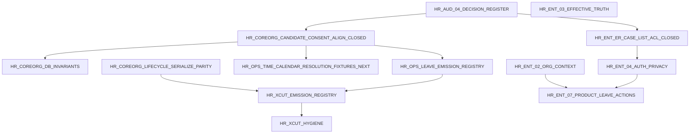

# HR-AUD-04 — Repair roadmap

| Field | Value |
|---|---|
| Mission | **HR-AUD-04** |
| Type | Consolidation only — defines repair program; **no product edits** |
| Ordering rule | Architecture → schema conflicts → DB → parity → commands → authz/app → enrichment → hygiene |
| Phase 0 | **Exit MET** — Slice 0.1 CLOSED · Slice 0.2 DECISION-REGISTER **DONE** · Slice 0.3 authority refresh **DONE** ([`00.hrm.md`](../../00.hrm.md)) |
| Active mission queue | [`44-next-repair-mission.md`](44-next-repair-mission.md) → **HR-OPS-LEAVE-EMISSION-REGISTRY** (Slice 1.1 calendar **CLOSED**) |

Related: [`41-consolidated-conflict-register.md`](41-consolidated-conflict-register.md) · [`44-next-repair-mission.md`](44-next-repair-mission.md)

---

## Dependency overview

---

## Tier 0 — Architecture decision register (docs-only)

### HR-AUD-04-DECISION-REGISTER — **DONE** (Slice 0.2 · 2026-07-24)

| Field | Value |
|---|---|
| **Status** | **DONE** — all OPEN-DECISION-01…05, A1…A3, C1 **RATIFIED** in [`41-consolidated-conflict-register.md`](41-consolidated-conflict-register.md); [`00.hrm.md`](../../00.hrm.md) Slice 0.2 **DONE** |
| **HR-ENT** | HR-ENT-05, HR-ENT-06, HR-ENT-07, HR-ENT-04, OPEN-DECISION-05 |
| **Outcome** | Scratch decision log ratifying canonical recommendations from OPEN-DECISION-01…05, A1…A3, C1 without product code |
| **Allowed paths** | `docs-V2/_scratch/erp/human-resources-enterprise-audit/**`, `docs-V2/_scratch/slice/enterprise.md` (count refresh only if in same mission) |
| **Prohibited paths** | `packages/**`, `apps/web/**`, `@afenda/db` migrations |
| **Prerequisites** | HR-AUD-04 complete |
| **Acceptance** | Each OPEN-DECISION has recorded ratified choice (or owner-named hold); no orphan decisions — **met** (nine IDs ratified; A1 ratified without reopening CLOSED implementation) |
| **Tests** | None |
| **Commands** | `pnpm check:docs-trunk-ban` |
| **Migration risk** | None |
| **Rollback** | Revert Scratch edits |
| **Residual** | Ratification complete — owner missions still implement the ratified choices; do not treat OPEN-DECISION rows as unratified forks |

---

## Tier 1 — Authorization exposure closure

### HR-ENT-ER-CASE-LIST-ACL — **CLOSED** (Slice 0.1 · 2026-07-24)

| Field | Value |
|---|---|
| **Status** | **CLOSED** — not an open/next blocker |
| **HR-ENT** | HR-ENT-06 (primary), HR-ENT-07 (projection) |
| **Outcome** | All employee-case **list** queries enforce the same ACL + field projection contract as `getEmployeeCaseById`; finding HR-GOV-P0-001 **closed** |
| **Residual** | Employee Relations Memory/Drizzle list ACL **database parity** = **evidence residual only** (does not reopen this mission or HR-GOV-P0-001). OPEN-DECISION-02 (full auth layering) remains for HR-ENT-04-AUTH-PRIVACY |

---

## Tier 2 — Canonical schema / type conflicts

### HR-COREORG-CANDIDATE-CONSENT-ALIGN — **CLOSED** (Slice 0.1 · 2026-07-24)

| Field | Value |
|---|---|
| **Status** | **CLOSED** — not an open/next blocker |
| **HR-ENT** | HR-ENT-07, HR-ENT-16, HR-ENT-18 |
| **Outcome** | Candidate consent/retention fields aligned across Zod, domain type, DDL, Memory/Drizzle adapters; HR-COREORG-P0-001 **closed** |
| **Residual** | Hire orchestration still handoff-only (HR-COREORG-HIRE-ORCHESTRATION). OPEN-DECISION-A1 implemented — do not reopen |

### HR-OPS-OVERTIME-APPROVAL-AUTHORITY — **CLOSED** (Slice 0.1 · 2026-07-24)

| Field | Value |
|---|---|
| **Status** | **CLOSED** — not an open/next blocker |
| **HR-ENT** | HR-ENT-06 |
| **Outcome** | Overtime approve path enforces time approval authority; HR-OPS-P1-001 **closed** |
| **Residual** | None that reopen this finding; related overtime items (e.g. HR-OPS-P1-006 reapproval no-op) remain separate open findings |

---

## Tier 3 — Database and migration truth

### HR-COREORG-DB-INVARIANTS

| Field | Value |
|---|---|
| **HR-ENT** | HR-ENT-03, HR-ENT-16 |
| **Outcome** | DDL checks for assignment/contract date ranges and documented overlap policy where enterprise requires |
| **Allowed paths** | `@afenda/db` schema + migrations; migration tests in `packages/data-plane/db/__tests__/` |
| **Prohibited paths** | Unrelated HR domains; product UI |
| **Prerequisites** | HR-COREORG-CANDIDATE-CONSENT-ALIGN (**CLOSED**) |
| **Acceptance** | Migration tests green; invalid ranges rejected at DB or documented command-only with explicit exclusion register row |
| **Tests** | New/extended migration tests for date-range checks |
| **Commands** | `pnpm --filter @afenda/db test -- hr-tenant-foreign-keys-migration` (pattern); targeted new test file |
| **Migration risk** | **Medium** — check constraints may fail on dirty dev data |
| **Rollback** | Drop constraints in down migration |
| **Residual** | Open employment overlap remains command-enforced unless added |

### HR-OPS-LEAVE-OVERLAP-GUARD

| Field | Value |
|---|---|
| **HR-ENT** | HR-ENT-16 |
| **Outcome** | Approved leave windows cannot overlap per employee |
| **Allowed paths** | `src/leave/**`, leave adapters, optional DB exclusion constraint |
| **Prohibited paths** | Time domain unrelated changes |
| **Prerequisites** | HR-OPS-TIME-CALENDAR-RESOLUTION-FIXTURES (confidence in calendar chain) |
| **Acceptance** | Unit test rejects overlapping approved requests |
| **Tests** | New leave overlap test |
| **Commands** | `pnpm --filter @afenda/human-resources test -- human-resources.leave` |
| **Migration risk** | **Low–Medium** if DB exclusion added |
| **Rollback** | Revert command guard / constraint |
| **Residual** | HR-OPS-P2-004 closed |

---

## Tier 4 — Store and adapter parity

### HR-COREORG-LIFECYCLE-SERIALIZE-PARITY — **CLOSED** (2026-07-24)

| Field | Value |
|---|---|
| **Status** | **CLOSED** — Slice 1.2 ([`00.hrm.md`](../../00.hrm.md)); do not reopen |
| **HR-ENT** | HR-ENT-18 |
| **Outcome** | Lifecycle transfer movement timestamps serialize identically Memory/Drizzle |
| **Allowed paths** | `adapters/drizzle/lifecycle.ts`, `adapters/memory/lifecycle.ts`, lifecycle parity tests |
| **Prohibited paths** | Recruitment; apps/web |
| **Prerequisites** | HR-COREORG-CANDIDATE-CONSENT-ALIGN (**CLOSED**) |
| **Acceptance** | `human-resources.lifecycle.parity.test.ts` transfer case green |
| **Tests** | Lifecycle parity suite |
| **Commands** | `pnpm --filter @afenda/human-resources test -- human-resources.lifecycle.parity` |
| **Migration risk** | None |
| **Rollback** | Revert mapper change |
| **Residual** | HR-COREORG-P2-002 **CLOSED** |

### HR-OPS-TIME-CALENDAR-RESOLUTION-FIXTURES — **CLOSED** (Slice 1.1)

| Field | Value |
|---|---|
| **Status** | **CLOSED** (2026-07-24) — not an open/next blocker ([`44`](44-next-repair-mission.md)) |
| **HR-ENT** | HR-ENT-16, HR-ENT-14 |
| **Outcome** | Calendar scope + employee work calendar resolution tests green |
| **Allowed paths** | `src/time/**`, calendar tests, assignment-context test helpers |
| **Prohibited paths** | Leave emission registry; apps/web; reopening Slice 0.1 closed IDs |
| **Prerequisites** | Phase 0 exit MET (Slice 0.1–0.3); HR-COREORG-CANDIDATE-CONSENT-ALIGN (**CLOSED**) |
| **Acceptance** | `calendar-scope*.test.ts`, calendar override block in `human-resources.time.test.ts` green |
| **Tests** | Calendar unit + Memory/Drizzle parity green (`REQUIRE_DATABASE_TESTS=1`) |
| **Commands** | `pnpm --filter @afenda/human-resources test -- calendar-scope human-resources.time` (+ DB parity + typecheck) |
| **Migration risk** | None |
| **Rollback** | Revert fixture/command fixes |
| **Residual** | HR-OPS-P1-005 **CLOSED** |

---

## Tier 5 — Command and query behavior

### HR-OPS-LEAVE-EMISSION-REGISTRY

| Field | Value |
|---|---|
| **HR-ENT** | HR-ENT-13, HR-ENT-16 |
| **Outcome** | All 18 leave mutations registered in `mutation-emission-registry.ts` with audit/domain_event mapping |
| **Allowed paths** | `src/mutation-emission-registry.ts`, leave command IDs, new leave emission parity test |
| **Prohibited paths** | Full 286-command registry in same mission |
| **Prerequisites** | HR-OPS-TIME-CALENDAR-RESOLUTION-FIXTURES |
| **Acceptance** | Leave registry 18/18; correlation test covers sample leave commands |
| **Tests** | New `leave-emission-registry-parity.test.ts` or extend existing |
| **Commands** | `pnpm --filter @afenda/human-resources test -- human-resources.leave correlation-integrity` |
| **Migration risk** | None |
| **Rollback** | Revert registry rows |
| **Residual** | HR-OPS-P0-001 tranche closed; HR-XCUT-P0-003 remains partially open |

### HR-COREORG-REHIRE-SEMANTICS

| Field | Value |
|---|---|
| **HR-ENT** | HR-ENT-16 |
| **Outcome** | `REHIRE_REQUIRES_ENDED_EMPLOYMENT` emitted when appropriate |
| **Allowed paths** | `src/core/employment.ts`, adapters, unit tests |
| **Prohibited paths** | Recruitment consent (separate mission) |
| **Prerequisites** | HR-COREORG-CANDIDATE-CONSENT-ALIGN (**CLOSED**) |
| **Acceptance** | Unit tests for rehire after termination + blocked active rehire |
| **Tests** | New/extended core employment tests |
| **Commands** | `pnpm --filter @afenda/human-resources test -- human-resources.core` |
| **Migration risk** | None |
| **Rollback** | Revert error mapping |
| **Residual** | HR-COREORG-P1-002 closed |

### HR-OPS-LEAVE-HANDOFF-PERMISSION

| Field | Value |
|---|---|
| **HR-ENT** | HR-ENT-12 |
| **Outcome** | Approved leave handoff uses dedicated least-privilege read permission |
| **Allowed paths** | `permissions.ts`, `module.manifest.ts`, `src/leave/leave-request.ts`, permission catalog seed |
| **Prohibited paths** | apps/web Actions (separate mission) |
| **Prerequisites** | None |
| **Acceptance** | Handoff query succeeds with handoff.read only |
| **Tests** | Leave handoff permission matrix test |
| **Commands** | `pnpm --filter @afenda/human-resources test -- human-resources.leave`; `pnpm --filter @afenda/db db:ensure-permission-catalog` |
| **Migration risk** | **Low** — permission catalog seed |
| **Rollback** | Revert permission + manifest |
| **Residual** | HR-OPS-P1-002 closed |

### HR-ENT-WFP-VARIANCE-ACTUALS

| Field | Value |
|---|---|
| **HR-ENT** | HR-ENT-11 |
| **Outcome** | Workforce plan variance compares to employment/assignment actuals OR contract renamed to reservation-consumed with documented semantics |
| **Allowed paths** | `src/workforce-planning/**`, WFP tests |
| **Prohibited paths** | Recruitment consent |
| **Prerequisites** | HR-COREORG-CANDIDATE-CONSENT-ALIGN (**CLOSED**); OPEN-DECISION-C1 ratified |
| **Acceptance** | Variance test with known employment count vs plan |
| **Tests** | WFP variance tests |
| **Commands** | `pnpm --filter @afenda/human-resources test -- workforce-planning` |
| **Migration risk** | None |
| **Rollback** | Revert query semantics |
| **Residual** | HR-GOV-P1-002 closed |

---

## Tier 6 — Authorization, privacy, application composition

### HR-ENT-04-AUTH-PRIVACY

| Field | Value |
|---|---|
| **HR-ENT** | HR-ENT-06, HR-ENT-07 |
| **Outcome** | Privacy port wired at apps/web composition root; authorization entry points unified or coverage-tested per OPEN-DECISION-02 |
| **Allowed paths** | `packages/erp/human-resources/src/privacy.ts`, `shared/contextual-authorization.ts`, `apps/web/lib/erp/human-resources-command-options.ts`, platform privacy adapter, auth tests |
| **Prohibited paths** | Domain feature UI; full emission registry |
| **Prerequisites** | HR-ENT-ER-CASE-LIST-ACL (**CLOSED**); OPEN-DECISION-02/03 ratified |
| **Acceptance** | Integration test: exportSubject with tenant isolation; sensitive command coverage test green |
| **Tests** | `contextual-authorization-privacy.test.ts`, privacy integration test |
| **Commands** | `pnpm --filter @afenda/human-resources test -- contextual-authorization-privacy`; targeted apps/web action test if added |
| **Migration risk** | None |
| **Rollback** | Revert composition wiring |
| **Residual** | HR-XCUT-P0-001, HR-XCUT-P0-004 partially closed |

### HR-ENT-07-PRODUCT-LEAVE-ACTIONS

| Field | Value |
|---|---|
| **HR-ENT** | HR-ENT-12 |
| **Outcome** | Leave Server Actions in apps/web mirroring time action patterns |
| **Allowed paths** | `apps/web/app/actions/hr-leave.ts`, HR leave features, action tests |
| **Prohibited paths** | Package domain rule duplication |
| **Prerequisites** | HR-OPS-LEAVE-HANDOFF-PERMISSION; HR-ENT-04-AUTH-PRIVACY (partial ok) |
| **Acceptance** | ActionResult tests for core leave mutations; permission runner used |
| **Tests** | `apps/web/__tests__/hr-leave*.ts` |
| **Commands** | `pnpm --filter @afenda/web test -- hr-leave` |
| **Migration risk** | None |
| **Rollback** | Remove actions file |
| **Residual** | HR-OPS-P1-003 closed |

### HR-ENT-12-GOV-PRODUCT-SLICE

| Field | Value |
|---|---|
| **HR-ENT** | HR-ENT-12 |
| **Outcome** | Server Actions for compliance/ER/WFP/talent (minimum one command per aggregate) |
| **Allowed paths** | `apps/web/app/actions/**`, `features/human-resources/**` |
| **Prohibited paths** | Package store changes |
| **Prerequisites** | HR-ENT-ER-CASE-LIST-ACL (**CLOSED**); HR-ENT-04-AUTH-PRIVACY |
| **Acceptance** | Action tests per aggregate; permissions via runner |
| **Tests** | New apps/web tests |
| **Commands** | `pnpm --filter @afenda/web test -- hr-` |
| **Migration risk** | None |
| **Rollback** | Revert action files |
| **Residual** | HR-GOV-P1-004 closed |

---

## Tier 7 — Enterprise capability enrichment

| Mission | HR-ENT | Outcome summary |
|---|---|---|
| HR-COREORG-HIRE-ORCHESTRATION | HR-ENT-12 | Documented or atomic hire-from-offer chain |
| HR-ENT-02-ORG-CONTEXT | HR-ENT-04 | Dimension directory completeness + enterprise.md refresh |
| HR-ENT-03-EFFECTIVE-TRUTH | HR-ENT-05 | Matrix extension or exclusion register per OPEN-DECISION-01 |
| HR-XCUT-EMISSION-REGISTRY | HR-ENT-13 | Full 286-command registry + CI gate |
| HR-ENT-COMPLIANCE-EXPIRY-OPS | HR-ENT-09 | Nearing-expiry producer or documented manual scope |
| HR-ENT-14-ATTENDANCE-CONNECTOR | HR-ENT-14 | Production AttendanceSourcePort implementation |
| HR-ENT-TALENT-SENSITIVE-POLICY | HR-ENT-06 | Competency prefix in sensitive register |
| HR-ENT-WFP-SENSITIVE-POLICY | HR-ENT-06 | Headcount prefix in sensitive register |
| HR-ENT-TALENT-UNIT-TESTS | HR-ENT-18 | Dedicated talent unit suite |
| HR-ENT-WFP-RESERVATION-CONSUME | HR-ENT-16 | **CLOSED** Slice 1.3 — offer→reservation consume + reject paths green |
| HR-ENT-EVENT-CATALOG-COMPLIANCE | HR-ENT-09 | Register compliance events in `@afenda/events` |

*(Full mission sheets for Tier 7 follow same template as Tier 1–6 when scheduled; defer detailed sheets until Tier 1–6 complete.)*

---

## Tier 8 — Hygiene and optimization

| Mission | Findings | Commands |
|---|---|---|
| HR-XCUT-HYGIENE | HR-XCUT-P2-004, HR-OPS-P2-002, deprecated aliases | lint + grep zero deprecated imports |
| HR-XCUT-SENSITIVE-COVERAGE-TEST | HR-GOV-P2-006 | `contextual-authorization-privacy.test.ts` green (dynamic count or update 128) |
| Scratch doc refresh | HR-XCUT-P1-003, HR-COREORG-P1-004 | Slice 0.3 pack/README aligned; residual = enterprise.md → disk 286/141/99 |
| HR-COREORG-STRUCTURE-ALIGN | HR-COREORG-P2-001 | README doc-only |
| HR-OPS-TEST-LEAVE-CONCURRENCY-CLEANUP | HR-OPS-P3-001 | leave-concurrency suite clean exit |
| afenda-elite-repo-housekeeping | HR-XCUT-P3-009 | Remove deprecated Drizzle alias when zero imports |

---

## Program summary table

| Order | Mission | Tier | Primary HR-ENT | Closes (primary findings) | Status |
|---:|---|---:|---|---|---|
| 0 | HR-AUD-04-DECISION-REGISTER | 0 | HR-ENT-04/05/06/07 | OPEN-DECISION-01…05, A1…A3, C1 ratified | **DONE** (Slice 0.2) |
| — | Slice 0.3 authority refresh | 0 | HR-ENT-19 | Pack/README counts + status align; Phase 0 exit | **DONE** (Slice 0.3) |
| 1 | HR-ENT-ER-CASE-LIST-ACL | 1 | HR-ENT-06 | HR-GOV-P0-001 | **CLOSED** (Slice 0.1) — not a blocker |
| 2 | HR-COREORG-CANDIDATE-CONSENT-ALIGN | 2 | HR-ENT-07 | HR-COREORG-P0-001 | **CLOSED** (Slice 0.1) — not a blocker |
| — | HR-OPS-OVERTIME-APPROVAL-AUTHORITY | 5 | HR-ENT-06 | HR-OPS-P1-001 | **CLOSED** (Slice 0.1) — not a blocker |
| 3 | HR-COREORG-DB-INVARIANTS | 3 | HR-ENT-03 | cluster-a DDL gaps | open (roadmap) |
| 4 | HR-COREORG-LIFECYCLE-SERIALIZE-PARITY | 4 | HR-ENT-18 | HR-COREORG-P2-002 | **CLOSED** (Slice 1.2) — not a blocker |
| 5 | HR-OPS-TIME-CALENDAR-RESOLUTION-FIXTURES | 4 | HR-ENT-16 | HR-OPS-P1-005 | **CLOSED** (Slice 1.1) — not a blocker |
| 6 | HR-OPS-LEAVE-EMISSION-REGISTRY | 5 | HR-ENT-13 | HR-OPS-P0-001 | **next vertical** (sole active queue — [`44`](44-next-repair-mission.md)) |
| 7 | HR-OPS-LEAVE-HANDOFF-PERMISSION | 5 | HR-ENT-12 | HR-OPS-P1-002 | open (roadmap) |
| 8 | HR-ENT-04-AUTH-PRIVACY | 6 | HR-ENT-06/07 | HR-XCUT-P0-001/004 | open (post-queue) |
| 9 | HR-ENT-07-PRODUCT-LEAVE-ACTIONS | 6 | HR-ENT-12 | HR-OPS-P1-003 | open (roadmap) |
| 10 | HR-XCUT-EMISSION-REGISTRY | 7 | HR-ENT-13 | HR-XCUT-P0-003 | open (roadmap) |
| 11 | HR-ENT-03-EFFECTIVE-TRUTH | 7 | HR-ENT-05 | HR-XCUT-P0-002 | open (roadmap) |
| 12 | HR-XCUT-HYGIENE + enterprise.md count refresh | 8 | HR-ENT-19 | HR-XCUT-P1-003 residual | open (hygiene; pack aligned Slice 0.3) |

**Do not** schedule package-wide cleanup (emission registry full sweep, hygiene-only) as the **first** vertical mission per selection rule. Closed Slice 0.1 / Slice 1.1 / Slice 1.2 missions must not reappear as open/next blockers. Phase 0 exit MET · Slice 1.1 calendar **CLOSED** — execute leave emission registry next.

---

## Residual program risks

| Risk | Mitigation |
|---|---|
| Unaudited comp/perf/learning domains | Schedule HR-AUD follow-on pack before Major HR-ENT-16 claims for those domains |
| DATABASE_URL not loaded in parity CI | Fix vitest env wiring before parity-dependent missions close |
| OPEN-DECISION forks | **Mitigated** — Slice 0.2 ratified all nine IDs; cite ratified choices in owner missions (do not re-litigate) |
| Concurrent disk drift vs audit | Re-spot-check at mission start; update Scratch finding status |
