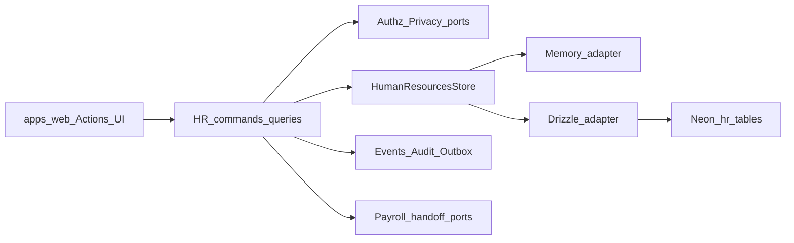

# HR-AUD-05 — Architecture composition and dual scores

| Field | Value |
|---|---|
| Mission | **HR-AUD-05** (composition + scoring) |
| Type | Scratch architecture + evaluation only — no product edits |
| Package | `@afenda/human-resources` |
| Evidence date | **2026-07-24** (live gates re-run this session) |
| Phase 0 | **Exit MET** — Slice 0.1 CLOSED · Slice 0.2 RATIFIED · Slice 0.3 DONE ([`00.hrm.md`](../../00.hrm.md)) |
| Active mission queue | [`44-next-repair-mission.md`](44-next-repair-mission.md) → **HR-OPS-TIME-CALENDAR-RESOLUTION-FIXTURES** |
| Composes | HR-AUD-00…04 pack + disk truth + live verification |
| Machine scores | [`46-dual-score-matrix.tsv`](46-dual-score-matrix.tsv) |

Related: [`42-five-axis-domain-scorecard.md`](42-five-axis-domain-scorecard.md) · [`43-repair-roadmap.md`](43-repair-roadmap.md) · [`44-next-repair-mission.md`](44-next-repair-mission.md) · [`00-authority-map.md`](00-authority-map.md)

---

## Executive summary

| Metric | Score | Band | Headline |
|---|---:|---|---|
| **Product Score** | **48 / 100** | **F** | Deep package domain logic; thin and uneven product surfaces; privacy/authz consumption gaps block safe operator use at scale |
| **Coding Score** | **74 / 100** | **C** | Mature command/store/adapter kernel, strong parity culture, green typecheck/lint on working tree; emission registry and calendar parity remain engineering debt |

**Verdict (unchanged from AUD-04):** **partially implemented** — substantial enterprise-grade domain depth with blocking defects concentrated in cross-cutting consumption (privacy, emission registry, unified authz), calendar/leave evidence gaps, and missing product Actions for most domains.

**Live delta vs AUD-04 consolidation date:** package **typecheck exit 0**, **candidate-consent** and **case-list ACL** focused tests green — Slice 0.1 CLOSED those verticals; Phase 0 exit MET (Slice 0.3); privacy port, emission registry (~31%), calendar fixtures, and product composition remain open implementation work.

---

## 1. Context

`@afenda/human-resources` is the sole Afenda-Lite bounded context for the employer–workforce relationship: records, structure, recruitment, lifecycle, leave, compensation terms, performance, learning, compliance, employee relations, time/attendance, talent, and workforce planning.

```text
Person → Worker → Employee (optional specialization)
```

| Fact | Value |
|---|---|
| Package | `@afenda/human-resources` |
| Manifest band | `R1-F` |
| Manifest lifecycle | `scaffolded` (honest posture) |
| Payroll | Separate package `@afenda/payroll` — HR exposes handoff facts only |
| Schema host | `@afenda/db` (`writeOwner: @afenda/human-resources` for 106 `hr_*` tables) |
| Tenancy | Shared Neon schema; hard `organization_id` on 106 `hr_*` roots of 179 repo roots |

Authority: [`human-resource.md`](../human-resource.md) · [`packages/erp/human-resources/README.md`](../../../packages/erp/human-resources/README.md)

---

## 2. Responsibilities and boundaries

| Owns | Does not own |
|---|---|
| HR domain commands, validation, business rules, events for `hr_*` | Physical DDL/migrations (`@afenda/db`) |
| Store adapters (`adapters/drizzle`, `adapters/memory`) | Payroll calculation / gross-to-net (`@afenda/payroll`) |
| Zod contracts under `src/schemas/` | UI (`@afenda/ui-system` in `apps/web` only) |
| Permission catalog codes (99) and manifest authz maps | Login accounts / Neon Auth credentials |
| Explicit handoff queries (leave, time, compensation, WFP→recruitment) | Platform workflow engine (HR-ENT-08 boundary) |

Application code composes ports at `apps/web/lib/erp/human-resources-*` and must not duplicate package domain rules ([`hr-enterprise-mission`](../../../.cursor/rules/hr-enterprise-mission.mdc)).

---

## 3. Components

### 3.1 Domain farms (`src/`)

| Farm | Path | Responsibility |
|---|---|---|
| Workforce foundation | `workforce-foundation/` | Person, worker, classification |
| Core | `core/` | Employee, employment, contracts, assignments, org-context |
| Organization | `organization/` | Departments, jobs, positions, reporting lines |
| Recruitment | `recruitment/` | Requisitions, candidates, applications, interviews, offers |
| Lifecycle | `lifecycle/` | Onboarding, probation, transfer, termination, offboarding |
| Leave | `leave/` | Policies, entitlements, requests, balances, handoff |
| Compensation & benefits | `compensation-benefits/` | Grades, bands, reviews, benefit enrollments |
| Performance | `performance/` | Cycles, goals, reviews, improvement plans |
| Learning | `learning/` | Courses, sessions, assignments, certifications |
| Talent | `talent/` | Competencies, profiles, pools, career/succession |
| Compliance | `compliance/` | Document requirements, work eligibility, policy acks |
| Employee relations | `employee-relations/` | Cases, actions, appeals, ACL + field projection |
| Time | `time/` | Calendars, shifts, attendance, timesheets, overtime, payroll handoff |
| Workforce planning | `workforce-planning/` | Headcount plans, reservations, availability |
| Integrations | `integrations/` | Platform fact projections |
| Shared | `shared/` | Command runners, guards, effective dating, contextual authz |

### 3.2 Public export surfaces

| Subpath | Role |
|---|---|
| `@afenda/human-resources` | Commands, queries, brands, schemas types, ports, production wiring |
| `@afenda/human-resources/adapters/drizzle` | `createDrizzleHumanResourcesStore` + domain slices |
| `@afenda/human-resources/authorization` | Authorization port types |
| `@afenda/human-resources/brands` | Branded entity IDs |
| `@afenda/human-resources/schemas` | Domain Zod shards |
| `@afenda/human-resources/store` | `HumanResourcesStore` port intersection |
| `@afenda/human-resources/testing` | Memory store + test harness (Vitest) |
| `@afenda/human-resources/module-manifest` | Module manifest export |

Root barrel excludes raw Drizzle tables, SQL, DB handles, and HTTP envelopes.

### 3.3 Store / adapter pattern

```text
Domain command/query (src/<farm>/*.ts)
  → HumanResourcesStore port (src/store/*.ts)
    → Memory: createMemoryHumanResourcesStore()
    → Drizzle: createDrizzleHumanResourcesStore()
```

- **16 Drizzle slices** composed via `composeStoreSlices` (core, organization, recruitment, lifecycle, leave, compensation-benefits, performance, learning, talent, time, workforce-planning, compliance, employee-relations, workforce-foundation, identity, helpers).
- **Memory mirror** under `src/adapters/memory/` with compile-time coverage guards.
- **Rule:** store slices = persistence only; cross-domain workflows stay in command layer ([`src/store/README.md`](../../../packages/erp/human-resources/src/store/README.md)).

---

## 4. Data / request flow



**Composition root:** [`apps/web/lib/erp/human-resources-command-options.ts`](../../../apps/web/lib/erp/human-resources-command-options.ts) wires authorization, audit, outbox, identity resolver, org dimensions, work calendar, approved leave query, attendance source, and document reference ports.

**Mutation path:** command validates input (Zod) → authorization guard → store mutation (version + idempotency) → audit/outbox emission (when registered) → domain event payload.

---

## 5. Schema map

| Metric | Count | Source |
|---|---:|---|
| Drizzle `hr*` table exports | 107 | `packages/data-plane/db/src/schema/human-resources.ts` |
| Hard-tenant `hr_*` roots | 106 | `packages/data-plane/db/src/hard-tenant-roots.ts` |
| SCHEMA-OWNERSHIP rows | 106 | `docs-V2/modules/SCHEMA-OWNERSHIP-MANIFEST.yaml` |
| Minimal scaffolds (id/org/timestamps only) | 8 | learning/comp/benefit scaffold tables |
| Registry gap | 1 | `hr_user_employee` in schema but absent from hard-tenant + ownership manifests |

### Patterns

- **Tenancy:** `organization_id NOT NULL` on virtually all tables; composite FKs include org scope.
- **Lifecycle:** status + effective dating (`effectiveFrom` / `effectiveTo`); **no soft-delete** columns.
- **Enums:** SQL `check(... IN (...))` on text columns — not Postgres enum types.
- **Mutation meta:** `id`, `version`, idempotency fingerprint, `createdBy`/`updatedBy`, timestamps on full tables.

### Domain clusters → example tables

| Cluster | Examples |
|---|---|
| Workforce foundation / core / org | `hr_person`, `hr_worker`, `hr_employee`, `hr_employment`, `hr_work_assignment`, `hr_department`, `hr_job`, `hr_position`, `hr_reporting_line` |
| Recruitment | `hr_job_requisition`, `hr_candidate`, `hr_candidate_application`, `hr_interview`, `hr_employment_offer` |
| Lifecycle | `hr_onboarding_case`, `hr_probation_review`, `hr_termination`, `hr_offboarding_case`, `hr_clearance` |
| Leave | `hr_leave_policy`, `hr_leave_entitlement`, `hr_leave_request`, `hr_leave_approval_decision` |
| Time | `hr_work_calendar`, `hr_shift`, `hr_attendance_event`, `hr_timesheet`, `hr_overtime_request` |
| Compensation / performance / learning | `hr_compensation_grade`, `hr_performance_cycle`, `hr_learning_course`, + 8 scaffolds |
| Talent / WFP | `hr_talent_profile`, `hr_succession_plan`, `hr_headcount_plan`, `hr_headcount_reservation` |
| Compliance / ER | `hr_employee_document`, `hr_work_eligibility`, `hr_employee_case`, `hr_employee_case_action` |

---

## 6. Capability inventory (summary)

Disk counts (manifest / module-ids, 2026-07-24):

| Surface | Count |
|---|---:|
| Commands | 286 |
| Queries | 141 |
| Permissions | 99 |
| Mutation tables | 106 |
| Emission registry entries | 88 (~31% of commands) |
| Effective-truth classified tables | 33 / 106 |
| Vitest files (`__tests__/`) | 73 |
| Parity suites (`*parity*`) | ~27 |

### Domain → command layer → store → tests

| Domain | Command home | Store slice | Key tests |
|---|---|---|---|
| Foundation | `workforce-foundation/` | `workforce-foundation` | `human-resources.foundation.parity`, `worker-foundation` |
| Core / org | `core/`, `organization/` | `core`, `organization` | `human-resources.core(.parity)`, `organization(.parity)` |
| Recruitment | `recruitment/` | `recruitment` | `human-resources.recruitment(.parity)`, `candidate-consent` |
| Lifecycle | `lifecycle/` | `lifecycle` | `human-resources.lifecycle(.parity)` |
| Leave | `leave/` | `leave` | `human-resources.leave(.parity)`, policy lineage, concurrency |
| Time | `time/` | `time` | Sharded: calendar, scheduling, attendance, timesheet, policy parity |
| Compensation | `compensation-benefits/` | `compensation-benefits` | `human-resources.compensation-benefits.parity` |
| Performance | `performance/` | `performance` | `human-resources.performance(.parity)` |
| Learning | `learning/` | `learning` | `human-resources.learning(.parity)` |
| Talent | `talent/` | `talent` | `human-resources.talent.parity` |
| Compliance | `compliance/` | `compliance` | `human-resources.compliance(.parity)` |
| Employee relations | `employee-relations/` | `employee-relations` | `employee-relations-case-list-acl`, `employee-relations(.parity)` |
| WFP | `workforce-planning/` | `workforce-planning` | `human-resources.workforce-planning(.parity)` |

Cross-cut: `effective-truth-adoption`, `correlation-integrity`, `emission-registry-parity`, `contextual-authorization-privacy`, `memory-coverage`, `drizzle-coverage`.

---

## 7. Critical parameters

| Parameter | Status | Evidence |
|---|---|---|
| **HR-ENT-01** Tenancy | Complete | 106 roots; `pnpm audit:tenancy-nulls` SSOT |
| **HR-ENT-02** Honest lifecycle | Complete | `lifecycle: scaffolded` in manifest |
| **HR-ENT-03** Person/worker foundation | Complete | Foundation parity green |
| **HR-ENT-04** Org context | Partial | Resolver exists; dimension directory wiring at app layer |
| **HR-ENT-05** Effective truth | Partial | 33/106 machine matrix only |
| **HR-ENT-06** Contextual authz | Partial | Four parallel authz surfaces remain; OPEN-DECISION-02 **RATIFIED** (Slice 0.2) → facade + ER plugin via HR-ENT-04-AUTH-PRIVACY |
| **HR-ENT-07** Privacy / retention | Gap | Privacy port types on disk; **not composed/consumed**; OPEN-DECISION-03 **RATIFIED** (Slice 0.2) |
| **HR-ENT-12** Product surfaces | Gap | 5 Action files; leave/core/recruitment/gov Actions absent |
| **HR-ENT-13** Operational readiness | Partial | Emission registry incomplete |
| **HR-ENT-18** Quality gates | Partial (live) | Typecheck/lint green 2026-07-24; AUD-04 recorded blocked |
| Emission registry | Fail (~31%) | 88 entries; leave 0/18; time 59/59 per AUD-04 |
| Privacy port | Fail | `src/privacy.ts` + port; unwired in command-options |
| Idempotency / version | Pass | Standard mutation meta on commands |
| Parity harness | Partial | Structure strong; DATABASE_URL parity not executed this session |

Full HR-ENT matrix: [`40-enterprise-completeness-matrix.tsv`](40-enterprise-completeness-matrix.tsv)

---

## 8. Product composition reality (`apps/web`)

### Server Actions

| File | Domains touched |
|---|---|
| [`hr-time.ts`](../../../apps/web/app/actions/hr-time.ts) | Time / attendance / timesheets |
| [`hr-learning.ts`](../../../apps/web/app/actions/hr-learning.ts) | Learning (partial) |
| [`hr-operations.ts`](../../../apps/web/app/actions/hr-operations.ts) | Operations / platform health |
| [`hr-self-service.ts`](../../../apps/web/app/actions/hr-self-service.ts) | Employee self-service subset |
| [`hr-mutation-context.ts`](../../../apps/web/app/actions/hr-mutation-context.ts) | Context stamping helper |

### Routes / features (partial)

- Operator: `/admin/human-resources`, `/candidates`, `/operations`
- Client: `/client/human-resources`, `/manager`
- Features: `human-resources-shell`, `attendance-control`, `operations-health`

**Gap:** ~427 package API entry points (286 commands + 141 queries) vs **5** Action modules — product exposes a small fraction of package capability. Leave, recruitment, core employee admin, compliance, ER, WFP, performance, and compensation have no dedicated Action farms.

---

## 9. Dual scoring model

### Axis → points (/10)

| Qualitative | Points |
|---|---:|
| Pass | 10 |
| Partial | 6 |
| Gap | 3 |
| Fail | 0 |
| N/A | exclude from average |
| Unaudited | 4 (low confidence) |

### Per-domain scores

- **Product /10** = average(Authz/Privacy, Correctness, Evidence) from [`42-five-axis-domain-scorecard.md`](42-five-axis-domain-scorecard.md), adjusted for live verify where noted.
- **Coding /10** = average(Contract, Correctness, Parity) from same scorecard.

Full row-level scores: [`46-dual-score-matrix.tsv`](46-dual-score-matrix.tsv)

### Package rollup (0–100)

| Score | Formula (weights) | Result |
|---|---|---:|
| **Product** | 30% domain readiness + 25% product composition + 20% authz/privacy consumption + 15% HR-ENT completeness + 10% handoffs | **48** |
| **Coding** | 25% contract + 25% correctness/gates + 20% parity + 20% cross-cut engineering + 10% discipline hygiene | **74** |

| Band | Range |
|---|---|
| A | 90–100 |
| B | 80–89 |
| C | 70–79 |
| D | 60–69 |
| F | &lt;60 |

### Factor breakdown

| Product factor | /100 | Notes |
|---|---:|---|
| Domain readiness | 66 | Cluster A/B strong except recruitment/calendar; C thin on product evidence |
| Product composition | 22 | 5 Action files vs 286 commands |
| Authz/privacy consumption | 33 | Privacy unwired; authz fragmented; ER ACL improving |
| HR-ENT completeness | 60 | 5 complete, 9 partial, 3 gap; HR-ENT-18 upgraded partial after live typecheck |
| Cross-system handoffs | 75 | Time/leave/comp/WFP handoff queries exist; platform facts partial |

| Coding factor | /100 | Notes |
|---|---:|---|
| Contract completeness | 83 | Recruitment improved; effective-truth scope partial |
| Correctness & gates | 78 | Typecheck/lint/focused tests green; calendar parity gap |
| Persistence parity | 78 | ~27 parity suites; recruitment/calendar/WFP edges |
| Cross-cut engineering | 52 | Emission 31%; effective truth 33/106 |
| Discipline hygiene | 82 | Store boundary docs, coverage guards, minimal TODO farm |

---

## 10. Prioritization queue

**Active mission queue (sole entry):** [`44-next-repair-mission.md`](44-next-repair-mission.md) → **HR-OPS-TIME-CALENDAR-RESOLUTION-FIXTURES**.

Score-ranked backlog below is diagnostic only — it does **not** override the active queue or reopen Slice 0.1 closed IDs. Sort key: `min(product_score, coding_score)` ascending, then P0 finding ID.

| Priority | Domain / surface | min(P,C) | Finding | Repair mission | Queue role |
|---:|---|---:|---|---|---|
| — | Calendar resolution | 5.3 | HR-OPS-P1-005 | HR-OPS-TIME-CALENDAR-RESOLUTION-FIXTURES | **Active next vertical** |
| 1 | Privacy port (cross-cut) | 0.0 | HR-XCUT-P0-004 | HR-ENT-04-AUTH-PRIVACY | Post-queue |
| 2 | Product composition (apps/web) | 3.0 | HR-OPS-P1-003, HR-GOV-P1-004 | HR-ENT-07-PRODUCT-LEAVE-ACTIONS; HR-ENT-12-GOV-PRODUCT-SLICE | Roadmap |
| 3 | Emission registry (cross-cut) | 3.0 | HR-XCUT-P0-003 | HR-XCUT-EMISSION-REGISTRY | Roadmap (not first vertical) |
| 4 | Authorization kernel (cross-cut) | 3.0 | HR-XCUT-P0-001 | HR-ENT-04-AUTH-PRIVACY | Post-queue |
| 5 | Integration / governance ports | 4.0 | HR-XCUT-P0-001 | HR-ENT-04-AUTH-PRIVACY | Post-queue |
| 6 | Compensation / performance / learning (unaudited) | 4.0 | — | HR-AUD follow-on depth pack | Follow-on audit |
| 7 | Lifecycle serialize parity | 5.0 | HR-COREORG-P2-002 | HR-COREORG-LIFECYCLE-SERIALIZE-PARITY | **CLOSED** Slice 1.2 |
| 8 | Recruitment hire orchestration | 5.0 | HR-COREORG-P1-005 | HR-COREORG-HIRE-ORCHESTRATION | Roadmap (consent **CLOSED** Slice 0.1 — do not reopen) |
| 9 | Leave emission | 5.3 | HR-OPS-P0-001 | HR-OPS-LEAVE-EMISSION-REGISTRY | Post-queue |
| 10 | Talent evidence | 5.3 | HR-GOV-P1-002 / evidence | HR-ENT-12-GOV-PRODUCT-SLICE · HR-ENT-WFP-VARIANCE-ACTUALS | Roadmap |
| — | Employee relations list ACL | — | HR-GOV-P0-001 | HR-ENT-ER-CASE-LIST-ACL | **CLOSED** Slice 0.1 — evidence residual only (ER DB parity); not a blocker |
| — | Candidate consent align | — | HR-COREORG-P0-001 | HR-COREORG-CANDIDATE-CONSENT-ALIGN | **CLOSED** Slice 0.1 — not a blocker |
| — | Overtime approval authority | — | HR-OPS-P1-001 | HR-OPS-OVERTIME-APPROVAL-AUTHORITY | **CLOSED** Slice 0.1 — not a blocker |

Program order from [`43-repair-roadmap.md`](43-repair-roadmap.md) after Phase 0: **calendar fixtures** → leave emission → auth/privacy → product Actions. Lifecycle serialize parity **CLOSED** Slice 1.2.

---

## 11. Verification report (live, 2026-07-24)

**Story:** HR package domain commands persist through Drizzle to `hr_*` tables; product exposes a thin Action/UI layer; cross-cutting privacy and emission consumption remain the primary production blockers.

| Boundary | Status | Evidence |
|---|---|---|
| Package typecheck | Pass | `pnpm --filter @afenda/human-resources typecheck` → exit **0** |
| Package lint | Pass | `biome check .` → 348 files, no fixes |
| ER case list ACL | Pass (closed) | `employee-relations-case-list-acl` — **10/10**; Slice 0.1 **CLOSED** |
| Candidate consent | Pass (closed) | `human-resources.recruitment.candidate-consent` green; Slice 0.1 **CLOSED** |
| Overtime approval authority | Pass (closed) | `overtime-approval-authority` green; Slice 0.1 **CLOSED** |
| Drizzle parity (ER) | Evidence residual | `DATABASE_URL` list-ACL parity not claimed closed — **not** an active blocker |
| Product UI | Partial | Routes exist; most domains lack Actions |
| Privacy port | Fail | Unwired at composition root (AUD-04 + disk) |
| Emission registry | Fail | ~31% command coverage (AUD-04) |
| Calendar resolution | Fail (open) | HR-OPS-P1-005 — **active next vertical** |

### Delta vs AUD-04 snapshot

| Item | AUD-04 (consolidation) | Live / Phase 0 exit (Slice 0.3) |
|---|---|---|
| Package typecheck | Fail (consent drift) | **Pass** |
| Recruitment consent | Fail | **CLOSED** (Slice 0.1) — residual open = hire orchestration |
| ER list ACL | Fail→Partial (spot-check) | **CLOSED** (Slice 0.1); ER DB parity = evidence residual only |
| Phase 0 authority | Open decisions / stale pack | **Exit MET** — decisions RATIFIED; pack counts 286/141/99/106 |
| Privacy / emission / product Actions | Fail / Gap | **Unchanged** (implementation still open) |
| Next vertical | Mixed | **HR-OPS-TIME-CALENDAR-RESOLUTION-FIXTURES** only |

---

## 12. Known limits

- Does **not** claim module Enterprise Readiness (HR-ENT-17 observation-only; Living MOD bodies dormant).
- Does **not** supersede HR-AUD-00…04 findings — composes and scores them.
- Compensation, performance, learning scored at **unaudited penalty (4/10)** pending dedicated cluster audit.
- DATABASE_URL parity suites not executed — parity scores inherit AUD-04 structure claims.
- Single-session live verify only; full `pnpm --filter @afenda/human-resources test` not run (narrow focused slice per plan).

---

## References

| Topic | Path |
|---|---|
| Package README | [`packages/erp/human-resources/README.md`](../../../packages/erp/human-resources/README.md) |
| Bounded-context map | [`docs-V2/_scratch/erp/human-resource.md`](../human-resource.md) |
| Enterprise gap matrix | [`docs-V2/_scratch/slice/enterprise.md`](../../slice/enterprise.md) |
| Five-axis scorecard | [`42-five-axis-domain-scorecard.md`](42-five-axis-domain-scorecard.md) |
| Repair roadmap | [`43-repair-roadmap.md`](43-repair-roadmap.md) |
| Dual score TSV | [`46-dual-score-matrix.tsv`](46-dual-score-matrix.tsv) |
