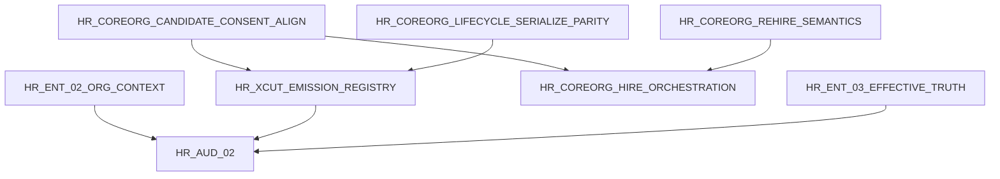

# HR-AUD-01 — Repair readiness (Cluster A)

| Field | Value |
|---|---|
| Mission | **HR-AUD-01** |
| Rule | Mission names only — no product repair prompts |

Findings: [`01-domain-findings.md`](01-domain-findings.md) · Conflicts: [`03-cluster-conflicts.md`](03-cluster-conflicts.md)

---

## Ordered repair candidates

| Order | Mission | Findings | HR-ENT | Unblocks |
|---:|---|---|---|---|
| 1 | **HR-COREORG-CANDIDATE-CONSENT-ALIGN** | P0-001, P1-001 | HR-ENT-07, HR-ENT-16 | Recruitment typecheck + all recruitment tests |
| 2 | **HR-COREORG-LIFECYCLE-SERIALIZE-PARITY** | P2-002 | HR-ENT-18 | **CLOSED** Slice 1.2 — lifecycle parity gate |
| 3 | **HR-XCUT-EMISSION-REGISTRY** (cluster A tranche) | P0-002 | HR-ENT-13, platform facts | transfer, termination, offer, assignment events |
| 4 | **HR-ENT-02-ORG-CONTEXT** | P1-004 | HR-ENT-04 | Time/Leave dimension consumers; refresh enterprise.md |
| 5 | **HR-COREORG-REHIRE-SEMANTICS** | P1-002 | HR-ENT-16 | Termination → rehire flows |
| 6 | **HR-COREORG-HIRE-ORCHESTRATION** | P1-005 | HR-ENT-12 | Product hire from offer accept |
| 7 | **HR-ENT-03-EFFECTIVE-TRUTH** (cluster A tranche) | P1-003 | HR-ENT-05 | `hr_person` + lifecycle table adoption rows |
| 8 | **HR-COREORG-STRUCTURE-ALIGN** | P2-001 | HR-ENT-15 | Developer navigation (doc-only acceptable) |
| 9 | **HR-COREORG-DB-INVARIANTS** | conflicts table | HR-ENT-03 | Date-range checks on assignment/contract at DDL |
| 10 | **HR-ENT-07-PRODUCT-OPS** (cluster A Actions) | scope note | HR-ENT-12 | Server Actions for core/lifecycle/recruitment mutations |

---

## Dependency graph



---

## Residual dependencies on other clusters

| Dependency | Consumer | Cluster A provides |
|---|---|---|
| **HR-AUD-02** (time/leave) | `resolveEmployeeOrgContextAsOf`, employment asOf, assignment asOf | Org-context + employment/assignment truth |
| **HR-AUD-03** (comp/compliance) | Employee identity, employment status | Employee/employment commands |
| **HR-XCUT-P0-004** (privacy port) | Candidate consent, employee PII | Candidate type defines consent; port not wired |
| **HR-ENT-04-AUTH-PRIVACY** | Sensitive recruitment reads (interview evaluation) | Permission exists; test `forbids confidential evaluation reads` blocked by candidate create |
| **@afenda/payroll** | Worker/employment facts | Worker foundation + employment bounded ranges |
| **Platform search/events** | Emission registry gaps | Only person/worker/employee create events registered |

---

## Verification ladder (post-repair)

```bash
pnpm --filter @afenda/human-resources typecheck
pnpm --filter @afenda/human-resources test -- human-resources.core human-resources.foundation \
  human-resources.organization human-resources.lifecycle human-resources.recruitment \
  position-occupancy worker-foundation workforce-foundation
REQUIRE_DATABASE_TESTS=1 pnpm --filter @afenda/human-resources test -- \
  foundation.parity core.parity organization.parity lifecycle.parity recruitment.parity \
  position-occupancy.parity
```

Exit criteria for Cluster A repair tranche: typecheck green; recruitment 11/11 unit + 4/4 parity; lifecycle parity transfer case green; emission registry cluster coverage documented with target count.
