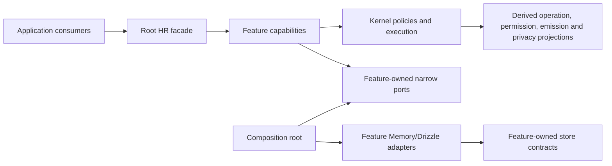

# Human Resources Development Roadmap

| Field | Value |
|---|---|
| Status | Approved Scratch execution plan for HR-ARCH-00; release authority excluded |
| Document type | Internal development roadmap |
| Product | Afenda-Lite Human Resources |
| Date | 2026-08-02 |
| Audience | HR product owners, ERP architects, package maintainers, security/privacy reviewers, Payroll integrators, application engineers, and release owners |
| Inputs | `human-resources-prd.md` and the living `packages/erp/human-resources` / `apps/web` implementation |
| Authority | Scratch engineering plan; code and `AGENTS.md` remain authoritative |
| Review disposition | Approved with corrections: architecture direction and immediate sequence accepted; structural cutover and launch authorization remain blocked by named gates |
| Verification basis | HR-0.1–HR-0.6 dirty-working-tree evidence on 2026-08-02; HR package digest `0c93d8d5e8e1ffbfcc9bde5acbb3acb55417ec3cd40596e5511675c98cd63cbf`; the [same-revision baseline](baseline-verification.md) is recorded but blocked; not commit, merge, deployment, or release evidence |

> This roadmap translates the Human Resources PRD into an evidence-based implementation sequence. It is not a Living controlled document, release approval, legal opinion, or claim that locally green tests establish production readiness.

## 1. Outcome and decision enabled

This roadmap enables the engineering team to develop Human Resources through one stable package facade while repositioning the internal package into a shallow, feature-first architecture:

```text
src/<feature>/<file-name>
```

The target is not merely a flatter directory tree. Each feature owns its schemas, states, policies, narrow store contract, persistence adapters, and operations. Cross-feature workflows consume explicit capabilities instead of reaching into peer implementations or the composite package store. Package composition constructs the aggregate; it does not own business meaning.

The roadmap preserves:

- one production business entrypoint: `@afenda/human-resources`;
- one isolated auxiliary entrypoint: `@afenda/human-resources/testing`;
- the existing root capability signatures unless a separately approved product-contract change names every affected consumer;
- the HR-to-Payroll transport boundary through `@afenda/events/schemas` and application composition;
- enterprise-quality tenancy, privacy, authorization, audit, outbox, idempotency, effective truth, recovery, and parity requirements.

### 1.1 Executive disposition

| Item | Status |
|---|---|
| Product vision | **Approved** |
| Domain ownership | **Approved** |
| HR–Payroll boundary | **Approved; documentation synchronized in this revision** |
| Feature-first direction | **Approved** |
| Immediate delivery sequence | **Approved** |
| Structural cutover | **Blocked pending semantic containment evidence; preliminary feature-first relocation in the working tree is not the final shallow cutover** |
| First launch scope | **Blocked pending Launch Profile decisions** |
| Production readiness | **Not claimed; package lifecycle remains `scaffolded`** |
| Next mission | **HR-0.6 database-revision and live-evidence closure** |

## 2. Repository baseline

The package is functionally broad and already organized around recognizable domains, but its structural cutover is incomplete.

### 2.1 Measured implementation inventory

| Evidence | Observed state | Interpretation |
|---|---:|---|
| Source files under `packages/erp/human-resources/src` | 502 TypeScript files | Large, mature implementation surface; migration must be contract-led rather than a blind move. |
| Unit test/support files under `packages/erp/human-resources/__tests__` | 215 TypeScript files | Strong local evidence base, but not a substitute for live Drizzle, recovery, privacy, security, accessibility, or release approval. |
| Feature capsules | 20 | Broad PRD coverage exists across workforce records, organization, planning, recruitment, hire, lifecycle, leave, time, compensation, performance, learning, talent, compliance, relations, privacy, reporting, bulk, reliability, and Payroll handoff. |
| Root package exports | `.` and `./testing` | Correct entrypoint count: one business facade and one isolated testing surface. |
| Package lifecycle | `scaffolded` | The implementation must not be described as production-approved. |
| Root `src/index.ts` | 2,820 lines | The facade is stable but oversized; contract inventory and derived export tests are required before internal movement. |
| Files deeper than `src/<feature>/<file>` | 487 of 502 | The current tree does not satisfy the shallow feature-first target. |
| Feature imports into `composition` | 31 occurrences | Dependency direction is inverted in multiple adapters and stores. |
| Feature imports into `facade` | 0 | The current graph has no feature-to-facade inversion; the target remains zero. |
| Production imports into `testing` | 2 | `composition/internal-api.ts` republishes testing performance and recovery surfaces. |
| Feature files naming `HumanResourcesStore` | 29 | Features know the aggregate package store instead of narrow owned contracts. |
| Cross-feature imports | 136 imports across 46 unique edges | Business capsules are coupled at implementation level. |
| Bidirectional feature edges | 5 pairs | Cycles exist between compensation/recruitment, lifecycle/workforce records, leave/time, organization/workforce records, and time/workforce records. |
| Feature adapters naming a composite store | 28 | Persistence adapters remain coupled to aggregate construction instead of feature-owned contracts. |
| Deep consumer imports | 0 | Consumers currently stay on declared package entrypoints. |
| Tests reading retired source paths | 18 | Filesystem-reading tests require a separate final-cutover rewrite from module imports. |
| Layout guard | Passes | It rejects retired layer-first roots only. The reporting-only architecture fixture measures the remaining debt against zero targets. |

### 2.2 Current feature coverage

The living package contains substantial implementations for all of the following:

- workforce identity, person, worker, employee, employment, contract, assignment, reporting and history;
- organization departments, jobs, positions, reporting lines and occupancy;
- headcount plans, lines, reservations, variance and hiring handoff;
- candidate, application, interview, offer, consent and accepted-offer conversion;
- onboarding, probation, confirmation, transfer, termination and offboarding;
- leave policy, entitlement, request, approval, balance and Payroll handoff;
- calendars, shifts, attendance, exceptions, timesheets, overtime and legal-minute allocation;
- compensation grades, salary bands, proposals, employee compensation, review cycles and benefit enrollment;
- performance cycles, goals, reviews, ratings and improvement plans;
- learning courses, sessions, assignments, attendance, completion and certification;
- competencies, profiles, pools, career plans, succession and mobility;
- compliance requirements, employee documents, work eligibility and acknowledgements;
- employee-relations cases, participants, evidence references, actions, outcomes and appeals;
- privacy retention, subject export, anonymization, legal holds and deletion decisions;
- reporting facts, bulk import/export, durable jobs, recovery helpers, observability and approved Payroll delivery.

This coverage means the roadmap should extend and contain the existing owners. It should not invent replacement modules or recover retired layer-first directories.

### 2.3 Reproduced verification evidence

The following reviewed artifacts now preserve HR-0.1–HR-0.4 evidence. They establish focused contract and architecture evidence only; they do not establish same-revision live-database, recovery, scale, independent-assurance, or release readiness.

| Evidence | Result |
|---|---|
| `__tests__/fixtures/public-contract.fixture.json` | Exactly `.` and `./testing`; 2,806 production symbols, 13 testing symbols, and 23 accepted capability objects are serialized by semantic public shape. |
| `__tests__/fixtures/consumer-inventory.fixture.json` | 109 consumer files and 1,441 references classified; 1,406 allowed, two exact testing-entrypoint uses allowlisted, zero forbidden, and filesystem/generated references retained for review. |
| `__tests__/fixtures/registry-projection.fixture.json` | 560 operations, 121 events, exhaustive authorization/emission/privacy governance, and 16 explicit temporal overrides are serialized from canonical owners. |
| `__tests__/fixtures/architecture-debt.fixture.json` | Ten debt categories report exact evidence with target zero; reductions pass while additions or replacement debt fail. |
| HR-0.4 package closure run | Lint checked 731 files; typecheck passed; 138 test files and 1,135 tests passed. HR-0.6 must rerun and record same-revision evidence rather than inherit this result. |

The reviewed architecture fixture reproduces 502 HR TypeScript source files, 20 feature directories, 487 files deeper than the proposed two-level target, 31 feature imports into composition, zero feature imports into facade, two production imports into testing, 29 feature files naming `HumanResourcesStore`, 136 cross-feature import occurrences over 46 unique edges, five bidirectional feature pairs, 28 feature adapters naming a composite store, zero deep consumer imports, and 18 path-reading tests tied to retired source locations.

## 3. PRD-to-code reconciliation

### 3.1 PRD corrections applied

The PRD was written before the latest HR-to-Payroll repairs. This documentation revision reclassifies the following as implemented baselines:

- compensation and benefit selection honors the requested effective date;
- employment status is emitted by HR rather than defaulted by Payroll;
- Payroll rejects inconsistent tenant, employee, period, timesheet identity and source-version lineage;
- unmatched employee and employer benefit components fail closed until a finalized Payroll rule owns the interpretation.

The PRD now separates implemented baseline, incomplete semantic coverage and release evidence outstanding so engineers are not directed to rebuild solved behavior.

### 3.2 Open PRD capability gaps confirmed by the code inventory

| PRD area | Current classification | Confirmed gap or constraint |
|---|---|---|
| Feature-first containment | Partial | Feature names exist, but deep nesting, composition imports, aggregate-store dependencies and five bidirectional feature relationships remain. |
| HR-to-Payroll completeness | Partial | Base compensation, benefits, leave, time and overtime are represented. Dedicated recurring allowance and bonus agreement facts, complete per-source lineage, and a Payroll-owned historical-version ingress ledger remain open. |
| Workforce variants | Partial | Core person/worker/employment models exist. Launch acceptance must explicitly prove concurrent employments, rehire, contingent/intern workers, international assignments and matrix reporting. |
| Recruitment experience | Partial | Internal pipeline exists. No dedicated career publishing/application surface, candidate self-scheduling capability, referral domain, or complete funnel/time-to-fill projection was found. |
| Leave operations | Partial | Policy, entitlement, request and balance foundations exist. Mandatory working-day policy and leave-encashment entitlement projection were not found. |
| Attendance channels | Partial | Attendance source ingestion and production adapter exist. Kiosk, badge/RFID, approved biometric-provider and mobile/geolocation adapters are not implemented as governed capabilities. |
| Performance and engagement | Partial | Cycles, goals, reviews and improvement plans exist. Continuous check-ins, governed 360 experience and recognition/badge grants require explicit capabilities and privacy policy. |
| External resources | Partial | HR already models equipment/document references and lifecycle handoffs. Provider contracts, acknowledgements and operational journeys remain incomplete; external ownership must stay outside HR. |
| Application journeys | Partial | Server actions cover broad HR operations, while visible product surfaces are concentrated on employee administration, recruitment, manager and self-service foundations. Full persona journeys and accessibility evidence remain open. |
| Reporting, scale and recovery | Partial | Reporting, bulk, parity and recovery tests exist. Live-database parity, durable scheduled bulk operation evidence, performance SLOs and recovery drills on the release revision remain required. |
| Documentation alignment | Reconciled in HR-0.5 | The package README separates implemented behavior, open product capability, and release evidence; deleted Scratch audit links were removed and replaced with the current PRD, roadmap, and living fixtures. |

### 3.3 Explicit external ownership

The following must not become new HR feature folders:

- gross-to-net, statutory payroll, payslips and payroll reconciliation;
- employee expense reimbursement, employee advances and accounting claims;
- payment execution and bank transmission;
- accounting journals and posting;
- equipment/fleet inventory truth;
- document bytes and e-signature execution;
- identity-provider, calendar-provider, email or SMS implementation.

HR may own eligibility, assignment references, approved facts, immutable external references and acknowledgement state. The owning bounded context performs the external business operation.

## 4. Target feature-first architecture

### 4.1 Required tree

All production source files must fit within two levels below `src`: a horizontal surface or business feature directory followed by a file. The `features/` container and nested `adapters/`, `schemas/`, `store/`, `authorization/`, `delivery/` and workforce subfeature directories are removed in the final structural cutover.

```text
packages/erp/human-resources/
├── src/
│   ├── index.ts
│   ├── facade/
│   │   ├── capabilities.ts
│   │   ├── context.ts
│   │   ├── contracts.ts
│   │   └── production-capabilities.ts
│   ├── composition/
│   │   ├── human-resources.store.ts
│   │   ├── human-resources.memory.ts
│   │   ├── human-resources.drizzle.ts
│   │   ├── module.manifest.ts
│   │   ├── production-ports.ts
│   │   └── platform-integrations.ts
│   ├── kernel/
│   │   ├── authorization.ts
│   │   ├── operation-registry.ts
│   │   ├── permission-registry.ts
│   │   ├── emission-registry.ts
│   │   ├── event-catalog.ts
│   │   ├── execution.ts
│   │   ├── identity.ts
│   │   ├── observability.ts
│   │   ├── privacy-policy.ts
│   │   ├── reliability.ts
│   │   ├── temporal.ts
│   │   └── validation.ts
│   ├── workforce-records/
│   │   ├── person.ts
│   │   ├── worker.ts
│   │   ├── employee.ts
│   │   ├── employment.ts
│   │   ├── employment-contract.ts
│   │   ├── assignment.ts
│   │   ├── identity-resolution.ts
│   │   ├── workforce-records.schema.ts
│   │   ├── workforce-records.store.ts
│   │   ├── workforce-records.memory.ts
│   │   └── workforce-records.drizzle.ts
│   ├── organization/
│   ├── workforce-planning/
│   ├── recruitment/
│   ├── hire-to-employee/
│   ├── employment-lifecycle/
│   ├── leave/
│   ├── time/
│   ├── compensation-benefits/
│   ├── performance/
│   ├── learning/
│   ├── talent/
│   ├── compliance/
│   ├── employee-relations/
│   ├── privacy/
│   ├── payroll-handoff/
│   ├── reporting/
│   ├── bulk-import/
│   ├── bulk-export/
│   ├── bulk-jobs/
│   └── testing/
├── __tests__/
├── package.json
└── README.md
```

The omitted feature folders use the same uniform file vocabulary where applicable:

```text
src/<feature>/
├── <aggregate-or-capability>.ts
├── <feature>.schema.ts
├── <feature>.policy.ts
├── <feature>.store.ts
├── <feature>.ports.ts
├── <feature>.memory.ts
├── <feature>.drizzle.ts
└── operation-registry.ts
```

Not every feature requires every file. Files exist only when they own real behavior. Large adapters may be split by cohesive aggregate using descriptive names such as `leave-entitlement.drizzle.ts`; they must not be hidden under another directory level.

### 4.2 Ownership rules

1. **Facade owns stability, not semantics.** `src/index.ts` exports the permanent business capabilities and types. It does not become a second registry or expose adapters, stores, constructors or storage records.
2. **Feature owns meaning.** Each business status, transition, policy, schema, operation and persistence contract is defined in its owning feature.
3. **Kernel composes cross-package semantics.** The kernel validates operation uniqueness, permission coverage, emission policy, temporal policy and privacy disposition from feature definitions. It does not redefine feature rules.
4. **Composition constructs implementations.** Composition may know every feature adapter. Features may not import composition, facade or testing.
5. **Narrow ports replace peer implementation knowledge.** A feature needing another feature's fact defines the smallest capability it consumes. Composition wires the owning capability to that port.
6. **Workflow features coordinate, but do not absorb ownership.** `hire-to-employee`, `employment-lifecycle` and `payroll-handoff` coordinate explicit capabilities and preserve source ownership.
7. **Adapters implement feature-owned stores.** A feature adapter cannot accept, construct or name `HumanResourcesStore`.
8. **Testing is isolated.** Production code cannot import `@afenda/human-resources/testing` or `src/testing`.
9. **Store boundaries are cohesive.** A feature-owned store covers one transactional aggregate or an explicitly approved set sharing one atomic consistency boundary. Broad features use descriptive files such as `attendance.store.ts`, `timesheet.store.ts` and `overtime.store.ts`; a shallow `time.store.ts` must not become another composite package store.

### 4.3 Intended dependency direction



Prohibited arrows:

- feature → composition;
- feature → facade;
- feature → testing;
- feature adapter → composite `HumanResourcesStore`;
- feature → peer adapter or peer store implementation;
- ordinary consumer → adapter, schema subpath, store, constructor or internal registry.

### 4.4 Root facade stabilization

The 2,820-line root `src/index.ts` is a maintainability risk, but export cleanup must not be combined with semantic containment or the structural cutover.

- Phases 0–2 preserve accepted root export names and signatures.
- Internal implementation composition moves behind the facade without changing consumers.
- `src/index.ts` should become a declarative export surface derived from reviewed facade inventories, not a second semantic owner.
- A later public-contract review may remove obsolete exports only through an explicitly approved migration that names every affected consumer and deletes the superseded surface once.
- No adapter, store, composition constructor or persistence record may be newly exported while preserving the existing contract.

## 5. Launch and completeness gates

Before capability phases can make a launch-scope or lifecycle claim, an approved HR Launch Profile must name:

- launch countries, legal entities and worker categories;
- languages, calendars and timezones;
- required attendance channels and biometric/geolocation constraints;
- approved Payroll contract version;
- sensitive-data classes, masking and retention rules;
- worker/legal-entity volumes and concurrency;
- latency, availability, RTO and RPO objectives;
- independent security, privacy, legal/localization, accessibility, operations and Payroll sign-offs.

The first launch jurisdictions are Malaysia and Vietnam. The Launch Profile remains a Scratch approval gate while Living `docs/` is dormant, and the legal entities, localization obligations, attendance/privacy constraints, scale/SLOs, and independent sign-off owners for those jurisdictions remain open. It cannot be called a controlled Living document or assigned a controlled ID until the Docs lane is explicitly reopened.

| Classification | Roadmap meaning |
|---|---|
| Product baseline | Permanent owner, semantic model and stable boundary exist without future redesign. |
| Launch-required | Capability and operational evidence must pass for the approved first cohort. |
| Subsequent approved release cohort | Requirement retains a named owner, contract, acceptance criteria and phase. It is not treated as implemented, completed or removable. |

This classification controls release sequencing only. It does not lower quality, authorize stubs/shims, or permit an open requirement to satisfy a phase closure gate.

## 6. Delivery roadmap

No calendar duration is assigned because team capacity and launch cohort are not approved. The sequence is dependency-based. A phase closes only when its acceptance evidence passes on the same revision.

### Phase 0 — HR-ARCH-00 contract and evidence freeze

**Objective:** establish the exact contract that internal restructuring must preserve.

Deliverables:

- serialize the root export and capability inventory, including accepted signatures and entrypoint disposition;
- count and classify every production consumer of `@afenda/human-resources` and the allowed testing consumers;
- record the operation, permission, emission, event, privacy and effective-truth registry projections;
- preserve the PRD's reconciled HR-to-Payroll classification against living code;
- replace missing README evidence links with current files or remove them;
- capture current lint, typecheck, unit, affected web and live-parity status without promoting package lifecycle.

Bounded closure slices:

| Slice | Status | Outcome | Closure evidence |
|---|---|---|---|
| HR-0.1 | Closed | Root export and capability fixture | Fixture detects export, signature and entrypoint drift. |
| HR-0.2 | Closed | Consumer and entrypoint inventory | Every production/testing consumer is classified; auxiliary testing use is allowlisted. |
| HR-0.3 | Closed | Registry projection fixtures | Operation, permission, emission, event, privacy and effective-truth projections detect unauthorized drift. |
| HR-0.4 | Closed | Reporting-only architecture debt reporter | Ten categories reproduce exact debt evidence against zero targets without rewriting production files. |
| HR-0.5 | Closed | PRD and README reconciliation | Implemented/open/release claims match disk; deleted Scratch links are removed rather than recreated. |
| HR-0.6 | Environment and data compatibility verified / database revision blocked | Baseline verification, closure rerun, migration reconciliation, read-only compatibility probes, and live cohort | The [same-revision matrix](baseline-verification.md) records the original failures and verified repair rerun. The retained deterministic Neon validator passes 15/15 checks. Migration status now reports the contiguous frontier, current DDL probes derive the safe operator disposition, the unguarded parallel migration writer is deleted, and aggregate production probes find zero conflicts with the four data-sensitive pending migrations. Closure is blocked by 12 unapplied governed migrations and a live cohort that reproduced the missing `platform_domain_event.claim_token` column. |

Phase 0 closes only when these fixtures and reporters fail predictably when their protected contract or architecture invariant is deliberately violated in an isolated verification scenario.

Acceptance:

- a contract fixture fails on export/signature/operation-policy drift;
- every auxiliary entrypoint has a named accepted consumer class;
- PRD, README and code agree on implemented versus open Payroll handoff behavior;
- no production code changes are required in consumers for an internal representation cutover.

### Phase 1 — Semantic containment before movement

**Objective:** remove architectural coupling while files remain at their current paths.

Deliverables:

- define a dependency policy for all 20 features;
- replace 29 feature-file references to `HumanResourcesStore` with feature-owned store contracts;
- remove all 31 feature imports into composition;
- replace peer adapter/store imports with narrow consumed capabilities;
- break the five bidirectional feature relationships through explicit ownership and ports;
- decide each of the 136 cross-feature imports as allowed owner-contract usage, workflow coordination, or prohibited implementation coupling;
- narrow `composition/internal-api.ts` so it is not an unbounded semantic aggregator.

Execute one bounded feature relationship at a time in this order:

1. `leave` ↔ `time`;
2. `organization` ↔ `workforce-records`;
3. `employment-lifecycle` ↔ `workforce-records`;
4. `compensation-benefits` ↔ `recruitment`;
5. remaining cross-feature edges, each with an explicit approved direction.

Every pair slice identifies the canonical owner, names the consumed fact, defines the smallest internal port, converts Memory and Drizzle together, proves root-facade parity, and adds an anti-recurrence guard. No slice creates a second business facade or temporary re-export path.

Acceptance:

- zero feature imports from composition, facade or testing;
- zero `HumanResourcesStore` references beneath business features;
- zero feature dependency cycles;
- feature adapters compile against only their feature-owned contracts and kernel capabilities;
- root public API and production consumers remain unchanged.

### Phase 2 — Final shallow feature-first cutover

**Objective:** perform one collision-checked move into the target `src/<feature>/<file>` tree after semantic boundaries are clean.

Deliverables:

- create an explicit old-path → target-path manifest for all source and filesystem-reading test references;
- flatten `src/features/*`, nested adapter/schema/store/authorization directories, and nested kernel/composition directories;
- rewrite resolver-aware imports and separately update path-based test fixtures;
- delete the emptied `src/features` container and superseded nested directories in the same cutover;
- replace the current layout checker with recursive depth and dependency guards.

Acceptance:

- every production source file is `src/<file>` or `src/<surface-or-feature>/<file>`;
- no compatibility re-export, old-path shim or duplicate facade remains;
- package exports remain exactly `.` and `./testing`;
- package lint, typecheck, all HR unit tests and affected web consumer tests pass;
- repository checks reject a reintroduced third-level source directory, upward import, composite-store dependency or cycle.

### Phase 3 — Workforce and organization effective truth

**Objective:** close the P0 workforce foundation before expanding user journeys.

Deliverables:

- prove Person → Worker → Employee lifecycle and non-destructive participation end;
- prove concurrent employment, rehire, contingent/intern and international-assignment cases;
- make employment, contract, assignment, manager, organization dimensions, grade and calendar selection unambiguously as-of;
- close organization hierarchy, cycle prevention, position occupancy, headcount and matrix-reporting projections;
- complete sensitive-field purpose, masking, retention and audit dispositions.

Acceptance:

- Memory/Drizzle parity covers overlaps, gaps, supersession, rehire and concurrent employment;
- tenant-hostility tests cover every participating root and relation;
- historical organization and reporting-line queries reproduce prior truth;
- no report or app action independently reconstructs status or as-of policy.

### Phase 4 — Compensation and HR-to-Payroll semantic completion

**Objective:** deliver complete approved HR remuneration facts without moving payroll interpretation into HR.

Deliverables:

- add effective-dated allowance entitlement and bonus eligibility/agreement owners;
- distinguish employee and employer benefit terms while preserving Payroll rule ownership;
- extend handoff lineage for employment, assignment, compensation, benefit, allowance, bonus, leave, time and overtime sources;
- establish the Payroll-owned historical contract/version ingress ledger;
- preserve server-side handoff assembly and sealed application carry;
- add hostile tests for missing, stale, contradictory, cross-tenant and unpriced approved facts.

Acceptance:

- HR emits only the current canonical transport form;
- Payroll accepts historical forms only through its ingress normalization owner;
- every payable/deductible fact is snapshotted or blocks calculation—none is silently discarded;
- no HR↔Payroll package dependency or application-owned interpretation exists;
- the complete handoff contract passes HR, Events, Payroll and app-composition tests.

### Phase 5 — Recruitment and hire experience parity

**Objective:** turn the existing internal recruitment domain into complete candidate and recruiter journeys.

Deliverables:

- permissioned career publishing and accessible candidate application/status/withdrawal surfaces;
- consent, retention, correction, export and erasure-evaluation journeys;
- structured interview kits, mandatory scorecards and conflict declarations;
- injected calendar capability for candidate/interviewer self-scheduling;
- referral attribution and reward-eligibility facts without payment ownership;
- source, funnel, conversion and time-to-fill projections;
- idempotent accepted-offer conversion with headcount and compensation proposal evidence.

Acceptance:

- external candidates cannot access internal notes or tenant data;
- interviewer visibility is purpose- and assignment-bound;
- calendar/message provider failures are recoverable and do not corrupt recruitment state;
- accepted offers cannot exceed approved headcount without an authorized exception;
- candidate, recruiter and hiring-manager journeys pass accessibility and authorization evidence.

### Phase 6 — Leave, time and attendance operations parity

**Objective:** close operational work-time gaps while preserving Payroll's pricing boundary.

Deliverables:

- mandatory working-day policy with effective scope and authorized exceptions;
- leave-encashment entitlement/quantity fact for Payroll;
- secure connector contract for kiosk, badge/RFID, approved biometric providers and mobile/geolocation channels;
- source ordering, signature/identity, idempotency, quarantine and correction evidence;
- attendance, lateness, early-exit, absence, overtime, missing-event and leave-conflict workflows;
- responsive employee/manager time and leave experiences.

Acceptance:

- raw vendor/device identity never enters the HR facade;
- timezone, overnight shift, DST, holiday, rest-day and correction cases pass parity tests;
- biometric/geolocation minimization and retention are approved per launch jurisdiction;
- HR produces approved minutes and classifications only; Payroll remains the sole rate and amount owner.

### Phase 7 — Lifecycle, compliance, relations, privacy and external references

**Objective:** complete sensitive hire-to-retire control paths and their external acknowledgements.

Deliverables:

- effective onboarding/offboarding templates with dependencies, owners and evidence;
- access-revocation, equipment-return, document/signature and Payroll-final-fact acknowledgement contracts;
- complete probation, transfer, promotion, renewal, suspension, termination, resignation, retirement and rehire flows;
- employee-document/work-eligibility requirements, expiry and exception operations;
- confidential case row/field ACL parity across list and detail;
- subject access, export, correction, deletion evaluation, legal hold and downstream-reference inventory.

Acceptance:

- required state, audit, outbox, history and consistency rows commit atomically;
- external side effects begin from committed outbox work;
- lifecycle rollback never rewrites finalized history;
- managers cannot escalate into compensation, case, investigation or all-employee visibility;
- privacy/security reviewers approve the launch-cohort data inventory and retention behavior.

### Phase 8 — Performance, learning, talent and engagement

**Objective:** complete the people-development capabilities without allowing automation to make employment decisions.

Deliverables:

- 360 feedback, continuous check-ins, feedback requests and private-note policy;
- governed recognition/badge catalog and grant/revoke evidence;
- goal hierarchy and skills-evolution projections;
- learning compliance, certification expiry/renewal and mandatory training closure;
- succession, mobility, critical-role readiness, explainable criteria and calibrated analytics;
- accessible employee and manager development journeys.

Acceptance:

- participant, manager, HR and calibration visibility are distinct and tested;
- automated recommendations remain advisory and require recorded human approval;
- monetary recognition routes to an approved external owner;
- performance/talent reporting derives from canonical records and privacy policy.

### Phase 9 — Reporting, bulk, reliability, scale and recovery

**Objective:** prove the package can operate at the named enterprise scale.

Deliverables:

- reconciled as-of read models for every PRD reporting domain;
- durable scheduled import/export execution with claims, leases, acknowledgements, bounded retries and dead letters;
- allowlisted, redacted, formula-safe, purpose-bound exports;
- live Drizzle parity across all critical feature stores;
- fault injection for transactional, outbox, idempotency, concurrency and recovery behavior;
- measured performance at the approved worker/legal-entity scale;
- operator runbooks for recovery, replay, quarantine and reconciliation.

Acceptance:

- Memory/Drizzle parity passes on the release revision;
- bulk restart/replay does not duplicate business effects;
- failure after any transactional step rolls back all consistency-critical writes;
- measured latency, throughput, RTO and RPO meet approved SLOs;
- observability exposes canonical operation/outcome/correlation without sensitive payloads.

### Phase 10 — Application journeys and independent release assurance

**Objective:** turn package capability into approved product journeys and make the lifecycle decision with independent evidence.

Deliverables:

- employee, manager, recruiter, HR operator, HR leader, Payroll operator and auditor journey matrix;
- server-side scope enforcement and consistent `ActionResult` behavior;
- responsive, localized, timezone-safe and WCAG 2.2 AA experiences;
- migration rehearsal with source identity/version mapping and reconciliation;
- independent security, privacy, accessibility, employment-law/localization and operations review;
- module-readiness evidence and explicit lifecycle decision.

Acceptance:

- every launch journey names its root capability, authorization policy, failure behavior and evidence;
- no UI visibility check substitutes for server authorization;
- migration and rollback are rehearsed against the approved launch cohort;
- lifecycle changes only after all required evidence is green on one revision;
- unresolved launch-critical findings block promotion rather than becoming scheduled cleanup.

## 7. Critical path and dependencies

| Order | Milestone | Depends on | Why it is ordered here |
|---:|---|---|---|
| 1 | Contract/evidence freeze | None | Prevents an internal refactor from silently changing the public product. |
| 2 | Semantic containment | Contract freeze | Removes the architectural cause before moving files. |
| 3 | Shallow structural cutover | Semantic containment | Makes the final move mechanical, bounded and enforceable. |
| 4 | Workforce/effective truth | Stable internal topology | All downstream HR decisions depend on correct workforce context. |
| 5 | Compensation/Payroll completeness | Workforce/effective truth | Approved remuneration facts require employment and assignment lineage. |
| 6 | Recruitment/hire and time/leave | Workforce + organization | These can progress as separate bounded missions once common truth is stable. |
| 7 | Lifecycle/privacy and people development | Workforce + app boundaries | Sensitive and developmental workflows depend on established scope and privacy. |
| 8 | Reporting/reliability | Feature semantics complete | Read models and recovery must project settled owners, not temporary shapes. |
| 9 | Product journeys/assurance | All required launch capabilities | Release evidence must validate the actual final revision and launch cohort. |

Recruitment/hire, time/leave and performance/learning/talent may be developed concurrently only when they do not edit the same semantic owner or shared composition surface. The final verification remains integrated.

## 8. Permanent architecture gates

The cutover is complete only when automated checks enforce all of the following:

- maximum production-source shape is `src/<feature>/<file>`;
- no root `features`, `adapters`, `schemas`, `store` or `shared` layer-first directory exists;
- features cannot import composition, facade or testing;
- feature adapters cannot depend on `HumanResourcesStore`;
- the feature graph is acyclic and approved cross-feature edges use contracts or narrow ports;
- operation IDs, permissions, emissions, events, privacy dispositions and effective-truth policy have one owner and derived projections;
- status values have one owner, event wire strings cannot be recreated locally, and historical transport aliases normalize at one ingress owner;
- root exports are contract-fixtured; adapters, stores, composition constructors and persistence records cannot leak; package entrypoints remain only `.` and `./testing`;
- production code cannot import the testing subpath;
- HR cannot import Payroll and Payroll cannot import HR;
- every current query declares an effective-date policy, every as-of selector fails deterministically on overlap, supersession lineage is preserved, and finalized history is never overwritten;
- every relation traversal proves organization scope, list/detail queries use the same row policy, masked fields stay absent from diagnostics/exports, and cross-tenant not-found behavior does not disclose existence;
- filesystem-reading tests and architecture checks scan recursively, including adapters and colocated tests;
- stale Scratch links are removed instead of recreating missing documents.

## 9. Verification matrix

| Change class | Minimum evidence |
|---|---|
| Internal dependency refactor | HR lint, typecheck, focused owner tests, architecture guards, root contract fixture, affected consumer typecheck |
| File cutover | Collision manifest, import resolution, depth guard, dependency guard, full HR tests, affected web tests, no old paths |
| Store/adapters | Memory/Drizzle parity, tenancy, concurrency, idempotency, rollback/fault injection |
| Status/workflow/policy | Registry contract, exhaustive transition tests, alias/normalization policy, derived projection parity |
| HR-to-Payroll | Events schema, HR producer, Payroll ingress/snapshot and app composition contract tests |
| Sensitive data | Contextual authorization, field projection, masking, export/deletion/legal-hold and safe-observability tests |
| User journey | Server action authorization/validation, package result mapping, accessibility, responsive states and failure recovery |
| Release decision | Full same-revision checks, live parity, performance, recovery rehearsal and independent assurance |

## 10. Risks and controls

| Risk | Control |
|---|---|
| A mass move hides semantic coupling | Remove aggregate-store, upward and cyclic dependencies before moving paths. |
| Facade cleanup breaks consumers | Freeze the public contract first; treat export reduction as a separate explicit product-contract decision. |
| New ports become duplicate business APIs | Ports describe only consumed capabilities and remain internal; the package root stays the sole business facade. |
| Kernel becomes a generic dumping ground | Feature rules stay in their owner; kernel only composes package-wide policy and projections. |
| Reports or UI re-interpret statuses | Derive projections from owners and forbid local status/permission/calculation maps. |
| Parallel legacy and target trees survive | One final cutover deletes superseded paths and adds recurrence guards in the same change. |
| Broad capability coverage is mistaken for readiness | Keep lifecycle `scaffolded` until live, operational and independent evidence passes. |
| Benchmark parity expands HR into other domains | Enforce the ownership matrix and use narrow references/events for Payroll, Expenses, Payments, Accounting, assets and documents. |

## 11. Immediate next mission

The next bounded engineering mission is **HR-0.6 database-revision and live-evidence closure**. HR-0.1 through HR-0.5 are closed. HR-0.6 has repaired and verified the recorded repository-integration failures, the retained deterministic Neon validator passes all 15 checks, and aggregate-only production probes prove the current data satisfies the explicit preconditions of migrations `0039`, `0044`, `0045`, and `0046`. The database ledger still has 12 pending governed migrations, and the complete required live lane has not passed on that governed revision.

Proceed in this order:

1. preserve the now-green module, generator, error-projection, audit, deleted-Scratch, explicit-parity, and deterministic Neon-environment gates;
2. through the authorized guarded procedure and an operator-supplied direct migration URL, transactionally apply the 12 pending forward migrations; do not use ledger backfill because all 12 read-only DDL probes report the governed artifacts absent; the recorded zero-conflict aggregate probes are precondition evidence, not permission to write;
3. prove `db:migration-status` reports zero pending, unknown, divergent, and out-of-order identities;
4. run all 38 registered fail-closed Drizzle parity, concurrency, failure-injection, rollback, and tenant-hostility files in bounded, non-overlapping cohorts against the same database snapshot;
5. record the final package digest, revision, branch, database snapshot, command, duration, test count, skipped count, and outcome;
6. close HR-0.6 only when every required row is green, then consider Phase 1.

The exact outcomes and commands are in the [HR-0.6 same-revision baseline](baseline-verification.md).

Do not mix the `leave` ↔ `time` containment exemplar, structural movement, new HR capability, or lifecycle promotion into HR-0.6. Phase 1 begins only after all six Phase 0 slices close with the required same-revision gates green.

## 12. Related Scratch document

- [Human Resources Product Requirements](human-resources-prd.md)
- [HR-0.6 Same-Revision Baseline Verification](baseline-verification.md)
- [`@afenda/human-resources` package README](../../../packages/erp/human-resources/README.md)
