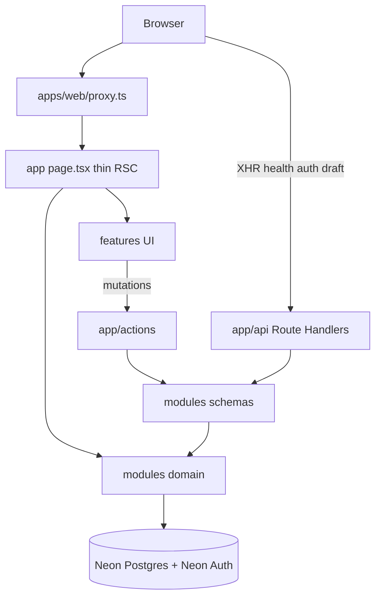

# Architecture (scratch)

| Field | Value |
|-------|-------|
| Surface | `docs-V2/nextjs/architecture.md` |
| Authority | **Scratch** — incremental-implementation · nextjs skill + Next 16.2 + MCP |
| Updated | 2026-07-19 |

---

## Layer diagram



---

## Hard bindings (Next 16.2)

| Topic | Rule |
|-------|------|
| RSC default | No `"use client"` unless hooks / DOM / events |
| Async client | **Invalid** |
| Props RSC→client | Serializable; only fields the client uses |
| `params` / `searchParams` / `cookies` / `headers` | Always `await` |
| Errors | Client `error.tsx`; do not swallow `redirect` / `notFound` |
| Coexistence | No `page.tsx` + `route.ts` same folder |
| Proxy / runtime | `proxy.ts` · Node default |
| Homes | Thin pages · `features/*` · `modules/*` |
| Env / UI / Outcomes | `@afenda/env` · `@afenda/ui-system` · `ActionResult<T>` |

---

## Rendering

Tenant / session surfaces are **request-time**. Never `force-static` on session-varying trees. Default: request-time + Suspense + `React.cache()` (primitive keys). `cacheComponents` / product `'use cache'` / PPR = **Off**.

| Surface | Policy |
|---------|--------|
| `/admin`, `/fft`, `/client/*`, auth | Request-time |
| Tenant RH | `no-store` / selective dynamic |
| `/api/health/*` | `auto` + short revalidate |

Perf order: security → waterfalls → serialization → Suspense → `React.cache()` → `after()` → imports. Detail: [practices.md](practices.md).

---

## Verify

```text
nextjs_index → get_routes → get_errors
```

Companion: [README.md](README.md) · [folders.md](folders.md) · [data.md](data.md).
