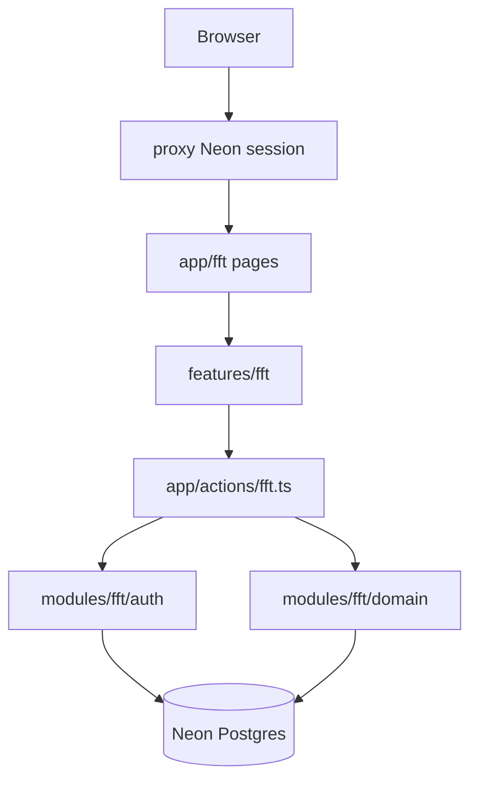

# FFT-MOD-001 Module Architecture

| Field | Value |
|-------|-------|
| ID | FFT-MOD-001 |
| Category | Module |
| Version | 1.0.0 |
| Status | Living |
| Owner | Feed Farm Trade |
| Updated | 2026-07-13 |
| Spine | MOD-001 Module Architecture |

**Audience:** engineers / agents shaping `/fft` work.  
**Depth:** [ARCH-017](architecture/ARCH-017-feed-farm-trade-event-engine.md) · FE [ADR-004](../../adr/frontend/ADR-004-feed-farm-trade-architecture.md)  
**Runtime entry:** [FFT-MOD-008](FFT-MOD-008-ops-runtime.md)

## Context

Feed Farm Trade is a product module inside Afenda-Lite: a reusable trade event engine (events, orders, allocation, deposits/pickup, imports/notifications, ERP sync) under `/fft`, sharing Neon Auth, shared-schema tenancy, and the AdminCN operator shell.

## Responsibilities and boundaries

| Owns | Does not own |
|------|----------------|
| Trade domain under `modules/fft/` | Platform tenancy SQL / org resolution (ADR-002 / ARCH-023) |
| `/fft` routes + `features/fft` UI | Declaration portal / client workspace restore |
| Module RBAC catalog + `FFT_*` flags | Product-wide Afenda ERP client (adapter is module-local) |
| Gate/ops evidence under `ops/` | Portal Atmosphere / Guardian Auth |

**Non-goals:** separate FFT deployable; `modules/trade` rename; project-per-tenant isolation.

## Components

## Data / request flow

1. Session via Neon Auth → platform org + `fft.access` entry.
2. RSC pages under `app/fft/**` stay thin; UI in `features/fft/*` inside `AdminCnShell`.
3. Mutations via Server Actions in `app/actions/fft.ts` → Zod schemas → domain.
4. Module gates in `modules/fft/auth/*` (`fft-session`, phase2b/2d flags).
5. Reads prefer domain from Server Components — do not fetch own `/api/*` for ordinary UI reads ([ARCH-013](../../architecture/frontend/ARCH-013-bff-and-data-flow.md)).

## Key decisions

| Decision | Where |
|----------|-------|
| Permission-catalog RBAC | [ADR-006](adr/ADR-006-feed-farm-trade-rbac.md) |
| Finance deposit + pickup ops | [ADR-007](adr/ADR-007-feed-farm-trade-finance-deposit-pickup-ops.md) |
| Imports + notifications | [ADR-008](adr/ADR-008-feed-farm-trade-imports-notifications.md) |
| ERP sync | [ADR-009](adr/ADR-009-feed-farm-trade-erp-sync.md) |
| Phase 1 engine acceptance | [ARCH-017](architecture/ARCH-017-feed-farm-trade-event-engine.md) |
| Product shell locks | [ADR-003](../../adr/frontend/ADR-003-feed-farm-trade-module.md) · [ADR-004](../../adr/frontend/ADR-004-feed-farm-trade-architecture.md) · [ADR-005](../../adr/frontend/ADR-005-feed-farm-trade-roadmap.md) |

## Failure modes

- User signed in without `fft.access` → `/fft` denied (expected; not RBAC regression).
- Feature flags off → 2B/2C/2D write paths must no-op or deny via phase guards.
- Soft tenancy / dual-mode SQL — **retired**; never reintroduce.

## Operational considerations

Production RBAC and gate history live in [FFT-MOD-008](FFT-MOD-008-ops-runtime.md) and [RB-002](ops/RB-002-feed-farm-trade-gate-register.md). Do not mix unrelated repo refactors into FFT commits.

## Known limits / future changes

- 2D-3 vendor adapter blocked until customer integration contract.
- FFT child `organization_id` denorm deferred (ARCH-023 **D4**).
- Program reopen for new 2B–2D product scope needs explicit approval + slice approval.
