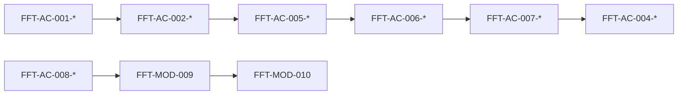

# FFT-MOD-009 Verification

| Field             | Value           |
| ----------------- | --------------- |
| **ID**            | FFT-MOD-009     |
| **Category**      | Module          |
| **Version**       | 2.1.0 |
| **Status**        | Living          |
| **Control State** | Closed          |
| **Owner**         | Feed Farm Trade |
| **Updated**       | 2026-07-17      |
| **Spine**         | MOD-009 Verification |

---

# 1. Purpose

Prove Feed Farm Trade Module Enterprise Readiness with a structured evidence table and verify commands. Wiring alone is not readiness ([MOD-002](../MOD-002-modules-index.md)).

**Audience:** engineers closing an FFT PR or gate.
**Action enabled:** record evidence against single-owner ACs in FFT-MOD-001…008; never invent PASS from prose, path presence, or historical program claims.

**Requirement owners:** FFT-MOD-001…008. **Claims:** [FFT-MOD-010](FFT-MOD-010-module-docs-index.md). **Standard:** [MOD-002](../MOD-002-modules-index.md).

---

# 2. Scope

## 2.1 In Scope

- Verification commands and residue guards (Target `apps/web/**`)
- Structured evidence table (MOD-002 schema)
- Integration-chain evidence view (references only)
- Done definition for evidence recording

## 2.2 Out of Scope

- Redefining product requirements → owning FFT-MOD-001…008
- Production allow/forbid → [FFT-MOD-008](FFT-MOD-008-ops-runtime.md)
- Readiness claim narrative → [FFT-MOD-010](FFT-MOD-010-module-docs-index.md)
- Platform testing pyramid policy detail → [AGENTS.md](../../../AGENTS.md)
- Inventing PASS from “ON DISK exists” or GUIDE-018 program-DONE narrative

---

# 3. Verification

## 3.1 Commands

Target paths under `apps/web/**` (Collapse root `app/` · `modules/` · `features/` remain banned).

```bash
# Residue (expect zero matches)
rg "FftShell|locale-switcher" apps/web/features/fft apps/web/modules/fft apps/web/app

# Phase 2A shell + hard tenancy (unit)
pnpm --filter @afenda/web test -- fft-permitted-vertical tenancy-isolation portal-chrome operator-paths

# Env flag keys (ARCH-027)
# Inspect packages/env/src/web.ts FFT_* keys vs FFT-MOD-003 Living flag table

# Browser smoke (when factory credentials available)
pnpm exec playwright test --project=smoke e2e/smoke/fft-permitted-vertical.spec.ts
```

Env: ARCH-027 — `@afenda/env` + `.env.local` (compose retired). Identities: [FFT-MOD-008](FFT-MOD-008-ops-runtime.md).

**Retired / absent Collapse commands (do not run as Living evidence):** `pnpm test:unit -- modules/fft`, `pnpm check:fft-ui-registry`, `node scripts/gate-7-production-smoke.mjs`, root `features/fft` / `app/fft` paths.

## 3.2 Residue guards

```bash
rg "FftShell|locale-switcher" apps/web/features/fft apps/web/modules/fft apps/web/app
```

## 3.3 Gate evidence pointers

Use [FFT-MOD-008](FFT-MOD-008-ops-runtime.md) for gate history, rollout, and Phase 2B–2D freeze. Record results in §3.5 — do not treat historic tags or path presence as fresh PASS.

## 3.4 Done definition

- AC text lives once in FFT-MOD-001…008
- Every Core / in-claim Conditional AC has a §3.5 row
- `PASS` requires Evidence Reference + Revision + Date
- Non-PASS / Out of Scope requires Blocker / Rationale
- Missing or stale runtime evidence → `NOT EVIDENCED` (never inferred PASS)

## 3.5 Structured evidence table

Schema authority: [MOD-002](../MOD-002-modules-index.md) §3.7. Parser-enforced; claim cannot say Claimable while blockers remain.

**I6.1 reconstruction run:** 2026-07-17 at checkout `fc16109` (local `main`). Target Phase 2A list-only shell under `apps/web/**` (GUIDE-018 I3.3 / Neon N18). Verified: residue guard (0 matches); `pnpm --filter @afenda/web test -- fft-permitted-vertical tenancy-isolation portal-chrome operator-paths` → 4 files / 21 tests passed. Browser `e2e/smoke/fft-permitted-vertical.spec.ts` not re-executed this run (factory credentials not required for unit floor). **Do not treat path presence as PASS.** Phase 2B–2D remain frozen per FFT-MOD-008 — commercial-cycle and ERP Core rows stay non-PASS.

| AC-ID | Owner MOD | Profile | Quality Dimension | Applicability | Activation | Evidence | Evidence Reference | Evidence Revision | Evidence Date | Blocker / Rationale |
| --- | --- | --- | --- | --- | --- | --- | --- | --- | --- | --- |
| FFT-AC-001-01 | FFT-MOD-001 | Enterprise Core | CORE-ARCH | Core | Enabled | PASS | `rg "FftShell\|locale-switcher" apps/web/features/fft apps/web/modules/fft apps/web/app` (0 matches) | fc16109 | 2026-07-17 | |
| FFT-AC-001-02 | FFT-MOD-001 | Enterprise Core | CORE-ARCH | Core | Enabled | PASS | `pnpm --filter @afenda/web test -- fft-permitted-vertical` (requireFftAccess deny/allow · layout wire) | fc16109 | 2026-07-17 | |
| FFT-AC-001-03 | FFT-MOD-001 | Enterprise Core | CORE-ARCH | Core | Enabled | NOT EVIDENCED | `pnpm --filter @afenda/web test -- fft-permitted-vertical` · FFT-MOD-008 §3.1 freeze | fc16109 | 2026-07-17 | Entitlement deny evidenced under 001-02; adapter/runtime fault suites for commercial mutations absent under Phase 2A list-only freeze |
| FFT-AC-002-01 | FFT-MOD-002 | Enterprise Core | CORE-PROCESS | Core | Enabled | NOT EVIDENCED | FFT-MOD-008 Phase 2B–2D freeze · GUIDE-018 I3.3 list-only | fc16109 | 2026-07-17 | End-to-end trade cycle (event→order→allocate→complete) not in Phase 2A Allowed envelope |
| FFT-AC-002-02 | FFT-MOD-002 | Enterprise Core | CORE-PROCESS | Core | Enabled | NOT EVIDENCED | `git ls-files apps/web/**/fft*` · missing `apps/web/app/actions/fft.ts` | fc16109 | 2026-07-17 | Target shell paths exist; exclusive ownership map incomplete (no `actions/fft.ts`); path presence alone is not PASS |
| FFT-AC-003-01 | FFT-MOD-003 | Enterprise Core | CORE-PLATFORM | Core | Enabled | NOT EVIDENCED | FFT-MOD-003 Living runtime table | fc16109 | 2026-07-17 | No dedicated FFT runtime conformance suite on Target; do not infer from package presence |
| FFT-AC-003-02 | FFT-MOD-003 | Enterprise Core | CORE-PLATFORM | Core | Enabled | PASS | `packages/env/src/web.ts` FFT_* keys · FFT-MOD-003 flag table · ARCH-027 | fc16109 | 2026-07-17 | |
| FFT-AC-003-03 | FFT-MOD-003 | Enterprise Core | CORE-PLATFORM | Conditional | Disabled | NOT EVIDENCED | Living `FFT_ERP_SYNC_ENABLED=false` (FFT-MOD-003) | fc16109 | 2026-07-17 | Flag off alone is not fail-closed runtime evidence without product gate tests |
| FFT-AC-004-01 | FFT-MOD-004 | Enterprise Core | CORE-DATA | Core | Enabled | PASS | `pnpm --filter @afenda/web test -- tenancy-isolation fft-permitted-vertical` (`listEvents` / `withOrg` empty-org fail-closed) | fc16109 | 2026-07-17 | |
| FFT-AC-004-02 | FFT-MOD-004 | Enterprise Core | CORE-DATA | Core | Enabled | NOT EVIDENCED | FFT-MOD-008 freeze (no allocation/write races in Phase 2A) | fc16109 | 2026-07-17 | Concurrency/transaction suites for trade writes not in Allowed envelope |
| FFT-AC-004-03 | FFT-MOD-004 | Enterprise Core | CORE-DATA | Core | Enabled | NOT EVIDENCED | FFT lane migrations / material mutation audit | fc16109 | 2026-07-17 | Phase 2A list-only shell has no material FFT mutation audit suite on Target |
| FFT-AC-005-01 | FFT-MOD-005 | Enterprise Core | CORE-SECURITY | Core | Enabled | NOT EVIDENCED | `pnpm --filter @afenda/web test -- fft-permitted-vertical` (`fft.access` entry) | fc16109 | 2026-07-17 | Entry SoT evidenced; fine-grained `rbac-catalog.ts` absent under Phase 2A freeze — compound AC not fully PASS |
| FFT-AC-005-02 | FFT-MOD-005 | Enterprise Core | CORE-SECURITY | Core | Enabled | NOT EVIDENCED | tenancy-isolation empty-org `listEvents` · two-org FFT event fixture not asserted this run | fc16109 | 2026-07-17 | Empty-org fail-closed covered under 004-01; signed-in deny + cross-org FFT list isolation not freshly PASS-bound |
| FFT-AC-005-03 | FFT-MOD-005 | Enterprise Core | CORE-SECURITY | Core | Enabled | NOT EVIDENCED | Platform `platform_rbac_audit` (non-FFT admin) | fc16109 | 2026-07-17 | FFT-sensitive permission-admin audit surface not shipped under Phase 2A freeze |
| FFT-AC-005-04 | FFT-MOD-005 | Enterprise Core | CORE-SECURITY | Core | Enabled | NOT EVIDENCED | FFT-MOD-008 freeze | fc16109 | 2026-07-17 | Trade mutation abuse/phase gates require 2B+ reopen |
| FFT-AC-006-01 | FFT-MOD-006 | Enterprise Core | CORE-EXPERIENCE | Core | Enabled | NOT EVIDENCED | FFT operator a11y / interaction | fc16109 | 2026-07-17 | No FFT interaction/a11y suite for primary journeys on Target |
| FFT-AC-006-02 | FFT-MOD-006 | Enterprise Core | CORE-EXPERIENCE | Core | Enabled | NOT EVIDENCED | `apps/web/features/fft/*` · `app/(operator)/fft/*` loading/empty states | fc16109 | 2026-07-17 | Shell present; journey-state / registry verify not executable as PASS |
| FFT-AC-006-03 | FFT-MOD-006 | Enterprise Core | CORE-EXPERIENCE | Core | Enabled | NOT EVIDENCED | FFT-owned vi/en message keys | fc16109 | 2026-07-17 | Multi-locale FFT strings not evidenced (I18N02 N/A platform-wide; FFT Core AC still unmet) |
| FFT-AC-007-01 | FFT-MOD-007 | Enterprise Core | CORE-INTEGRATION | Core | Enabled | NOT EVIDENCED | missing `apps/web/app/actions/fft.ts` | fc16109 | 2026-07-17 | No trade Action entrypoint under Phase 2A Allowed envelope |
| FFT-AC-007-02 | FFT-MOD-007 | Enterprise Core | CORE-INTEGRATION | Core | Enabled | NOT EVIDENCED | FFT-MOD-008 freeze | fc16109 | 2026-07-17 | Idempotent trade writes not in Phase 2A scope |
| FFT-AC-007-03 | FFT-MOD-007 | Enterprise Core | CORE-INTEGRATION | Conditional | Disabled | NOT EVIDENCED | Living `FFT_ERP_SYNC_ENABLED=false` (FFT-MOD-003) | fc16109 | 2026-07-17 | Disabled ERP sync without executable fail-closed adapter tests |
| FFT-AC-008-01 | FFT-MOD-008 | Enterprise Core | CORE-OPERATIONS | Core | Enabled | NOT EVIDENCED | §3.1 Target verify commands | fc16109 | 2026-07-17 | Unit floor green; production incident/correlation drill for FFT not freshly executed |
| FFT-AC-008-02 | FFT-MOD-008 | Enterprise Core | CORE-OPERATIONS | Core | Enabled | NOT EVIDENCED | FFT-MOD-008 rollback prose · `pnpm audit:fft-promotion` | fc16109 | 2026-07-17 | Ops audit script / rollback drill not freshly executed on this HEAD |
| FFT-AC-008-03 | FFT-MOD-008 | Enterprise Core | CORE-OPERATIONS | Core | Enabled | NOT EVIDENCED | `pnpm audit:vercel` · prod flag vs Living MOD-008 | fc16109 | 2026-07-17 | Release/deploy evidence loop deferred to GUIDE-018 I6.3; not PASS here |
| FFT-AC-008-04 | FFT-MOD-008 | Enterprise Core | CORE-OPERATIONS | Conditional | Disabled | NOT EVIDENCED | FFT-MOD-008 allow/forbid + env flags | fc16109 | 2026-07-17 | Fail-closed ops for Disabled conditional capabilities not freshly executed |
| FFT-AC-002-03 | FFT-MOD-002 | ERP | ERP-PROCESS-CONTROLS | Core | Enabled | NOT EVIDENCED |  |  |  | ERP benchmark under Phase 2A freeze; fresh implementation evidence not reconstructed |
| FFT-AC-002-04 | FFT-MOD-002 | ERP | ERP-REPORTING | Core | Enabled | NOT EVIDENCED |  |  |  | ERP benchmark under Phase 2A freeze; fresh implementation evidence not reconstructed |
| FFT-AC-003-04 | FFT-MOD-003 | ERP | ERP-CONFIG-ALM | Core | Enabled | NOT EVIDENCED |  |  |  | ERP benchmark under Phase 2A freeze; fresh implementation evidence not reconstructed |
| FFT-AC-004-04 | FFT-MOD-004 | ERP | ERP-MASTER-DATA | Core | Enabled | NOT EVIDENCED |  |  |  | ERP benchmark under Phase 2A freeze; fresh implementation evidence not reconstructed |
| FFT-AC-005-05 | FFT-MOD-005 | ERP | ERP-SOD-COMPLIANCE | Core | Enabled | NOT EVIDENCED |  |  |  | ERP benchmark under Phase 2A freeze; fresh implementation evidence not reconstructed |
| FFT-AC-006-04 | FFT-MOD-006 | ERP | ERP-LOCALIZATION | Core | Enabled | NOT EVIDENCED |  |  |  | ERP benchmark under Phase 2A freeze; fresh implementation evidence not reconstructed |
| FFT-AC-007-04 | FFT-MOD-007 | ERP | ERP-CLEAN-CORE-INTEGRATION | Core | Enabled | NOT EVIDENCED |  |  |  | ERP benchmark under Phase 2A freeze; fresh implementation evidence not reconstructed |
| FFT-AC-008-05 | FFT-MOD-008 | ERP | ERP-CUTOVER-OPERATIONS | Core | Enabled | NOT EVIDENCED |  |  |  | ERP benchmark under Phase 2A freeze; fresh implementation evidence not reconstructed |

---

## 3.6 Integration-chain evidence view

Cross-cutting path for fullstack review. Does **not** redefine sibling ACs — cite §3.5 rows only.



| Step | Referenced ACs | Review focus |
|------|----------------|--------------|
| 1 | FFT-AC-001-*, FFT-AC-005-*, FFT-AC-006-* | Entitled operator reaches `/fft` under operator shell |
| 2 | FFT-AC-007-* | Mutations via Actions + Zod + permission (frozen until 2B+) |
| 3 | FFT-AC-004-* | Hard `organization_id` + concurrency |
| 4 | FFT-AC-002-* | Business cycle event → … → audit/export (frozen until reopen) |
| 5 | FFT-AC-003-*, FFT-AC-008-* | Flags and prod allow/forbid respected |

## 3.7 Testing pyramid

Authority: [AGENTS.md](../../../AGENTS.md) § Testing · skill [verify.md](../../../.cursor/skills/feed-farm-trade/verify.md).

---

# 4. References

| ID | Title | Relationship |
| -- | ----- | ------------ |
| DOC-001 | Documentation Control Standard | Governance |
| MOD-002 | Modules Index | Evidence schema + claim rules |
| FFT-MOD-001…008 | FFT spine requirements | Single-owner AC text |
| FFT-MOD-008 | Ops Runtime | Gates / identities / freeze |
| FFT-MOD-010 | Module Docs Index and Roadmap | Readiness claims only |
| GUIDE-018 | Full-Stack E2E Integration Program | I6.1 ledger mission |

---

# 5. Change Log

| Version | Date       | Summary |
| ------- | ---------- | ------- |
| 2.1.0 | 2026-07-17 | **I6.1**: Target reconstruction `@fc16109` — Collapse verify commands retired; Phase 2A shell PASS on 001-01/001-02/003-02/004-01 only; remaining Core/ERP stay NOT EVIDENCED; never ON DISK as PASS. |
| 2.0.4 | 2026-07-15 | S7.3 honesty: Target `apps/web/modules/fft` shell port present; product AC rows remain BLOCKED (no 2B–2D reopen). |
| 2.0.3 | 2026-07-14 | GUIDE-016 Retired = DOC-002 register-only (archive stub removed). |
| 2.0.2 | 2026-07-14 | Bounded reopen: package-manager cutover (`pnpm`); ARCH-027 two-state env — retire Living compose evidence commands; Core rows stay BLOCKED/NOT EVIDENCED. |
| 2.0.0 | 2026-07-14 | Eleven-column contract ledger with Core/ERP dimensions; existing results preserved; new ERP rows NOT EVIDENCED; no PASS inferred. |
| 1.3.0   | 2026-07-14 | Evidence reconstruction at `764287d`: Core/ops rows BLOCKED (product tree absent); Conditional remain NOT EVIDENCED; no PASS inferred. |
| 1.2.0   | 2026-07-14 | Wave B: structured evidence ledger (MOD-002 schema); vacated inherited PASS; integration-chain view. |
| 1.1.1   | 2026-07-14 | Linked Draft GUIDE-016 for enterprise acceptance checklists. |
| 1.1.0   | 2026-07-14 | DOC-003 six-section retrofit; compact verification guide. |
| 1.0.1   | 2026-07-14 | Added mandatory Control State header field (Closed). |
| 1.0.0   | 2026-07-13 | Initial spine |

---

# 6. Notes

**Spine role:** MOD-009 Verification — evidence and result state only. Requirement text stays in MOD-001…008. GUIDE-016 is Retired in DOC-002 (register-only); do not cite it as AC authority.
