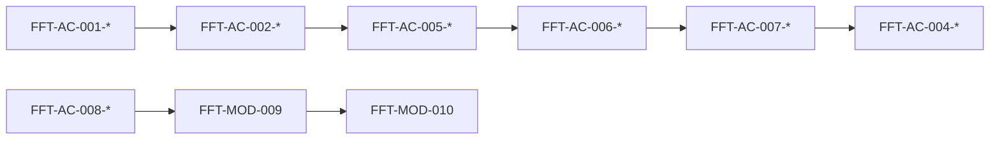

# FFT-MOD-009 Verification

| Field             | Value           |
| ----------------- | --------------- |
| **ID**            | FFT-MOD-009     |
| **Category**      | Module          |
| **Version**       | 2.0.3 |
| **Status**        | Living          |
| **Control State** | Closed          |
| **Owner**         | Feed Farm Trade |
| **Updated**       | 2026-07-14      |
| **Spine**         | MOD-009 Verification |

---

# 1. Purpose

Prove Feed Farm Trade Module Enterprise Readiness with a structured evidence table and verify commands. Wiring alone is not readiness ([MOD-002](../MOD-002-modules-index.md)).

**Audience:** engineers closing an FFT PR or gate.
**Action enabled:** record evidence against single-owner ACs in FFT-MOD-001…008; never invent PASS from prose or historical MVP claims.

**Requirement owners:** FFT-MOD-001…008. **Claims:** [FFT-MOD-010](FFT-MOD-010-module-docs-index.md). **Standard:** [MOD-002](../MOD-002-modules-index.md).

---

# 2. Scope

## 2.1 In Scope

- Verification commands and residue guards
- Structured evidence table (MOD-002 schema)
- Integration-chain evidence view (references only)
- Done definition for evidence recording

## 2.2 Out of Scope

- Redefining product requirements → owning FFT-MOD-001…008
- Production allow/forbid → [FFT-MOD-008](FFT-MOD-008-ops-runtime.md)
- Readiness claim narrative → [FFT-MOD-010](FFT-MOD-010-module-docs-index.md)
- Platform testing pyramid policy detail → [AGENTS.md](../../../AGENTS.md)

---

# 3. Verification

## 3.1 Commands

```bash
pnpm test:unit -- modules/fft
pnpm test:unit -- modules/fft/auth/fft-session
pnpm test:unit -- modules/fft/domain/rbac
pnpm test:interaction -- features/fft
pnpm test:e2e:smoke
pnpm test:e2e:journey
pnpm check:fft-ui-registry
node scripts/gate-7-production-smoke.mjs
```

Env: ARCH-027 two-state — docs-first/pre-S4.1 no compose / no `.env.local`; Target post-S4.1 `@afenda/env` + `.env.local` before E2E when the app exists. Identities: [FFT-MOD-008](FFT-MOD-008-ops-runtime.md) — do not conflate admin with sales allowlist.

## 3.2 Residue guards

```bash
rg "FftShell|locale-switcher" features/fft app/fft
```

## 3.3 Gate evidence pointers

Use [FFT-MOD-008](FFT-MOD-008-ops-runtime.md) for gate history, rollout, and promotion order. Record results in §3.5 — do not treat historic tag notes as fresh PASS.

## 3.4 Done definition

- AC text lives once in FFT-MOD-001…008
- Every Core / in-claim Conditional AC has a §3.5 row
- `PASS` requires Evidence Reference + Revision + Date
- Non-PASS / Out of Scope requires Blocker / Rationale
- Missing or stale runtime evidence → `NOT EVIDENCED` (never inferred PASS)

## 3.5 Structured evidence table

Schema authority: [MOD-002](../MOD-002-modules-index.md) §3.7. Parser-enforced; claim cannot say Claimable while blockers remain.

**Reconstruction run:** 2026-07-14 at checkout `764287d` (local `main`). Attempted residue, `pnpm test:unit -- modules/fft`, and `pnpm check:fft-ui-registry`. **Result:** all product verify paths are **BLOCKED** — this HEAD has no `app/`, `features/`, `modules/`, `testing/`, or `e2e/` tree (`git ls-files app/*` = 0). Those trees remain on `origin/main`. No row is marked PASS. Conditional Disabled rows stay `NOT EVIDENCED` until fail-closed behavior can be executed against product code. Do not infer PASS from Living prose or historical MVP narrative.

| AC-ID | Owner MOD | Profile | Quality Dimension | Applicability | Activation | Evidence | Evidence Reference | Evidence Revision | Evidence Date | Blocker / Rationale |
| --- | --- | --- | --- | --- | --- | --- | --- | --- | --- | --- |
| FFT-AC-001-01 | FFT-MOD-001 | Enterprise Core | CORE-ARCH | Core | Enabled | BLOCKED | `rg "FftShell\|locale-switcher" features/fft app/fft` | 764287d | 2026-07-14 | Command paths absent at HEAD (`features/fft`, `app/fft` missing); residue guard cannot run |
| FFT-AC-001-02 | FFT-MOD-001 | Enterprise Core | CORE-ARCH | Core | Enabled | BLOCKED | `pnpm test:unit -- modules/fft/auth/fft-session` | 764287d | 2026-07-14 | Product/test tree absent at HEAD (`modules/fft`, `testing/vitest.config.ts` missing) |
| FFT-AC-001-03 | FFT-MOD-001 | Enterprise Core | CORE-ARCH | Core | Enabled | BLOCKED | `pnpm test:e2e:smoke` | 764287d | 2026-07-14 | `e2e/` absent at HEAD; boundary journey cannot execute |
| FFT-AC-002-01 | FFT-MOD-002 | Enterprise Core | CORE-PROCESS | Core | Enabled | BLOCKED | `pnpm test:unit -- modules/fft/domain/trade` · `pnpm test:e2e:journey` | 764287d | 2026-07-14 | Domain/journey runners absent at HEAD |
| FFT-AC-002-02 | FFT-MOD-002 | Enterprise Core | CORE-PROCESS | Core | Enabled | BLOCKED | tree check `app/fft` · `features/fft` · `modules/fft` | 764287d | 2026-07-14 | Ownership paths absent at HEAD (`Test-Path` false for all three) |
| FFT-AC-003-01 | FFT-MOD-003 | Enterprise Core | CORE-PLATFORM | Core | Enabled | BLOCKED | `pnpm test:unit -- modules/fft` | 764287d | 2026-07-14 | Runtime unit suite cannot load (`testing/vitest.config.ts` unresolved) |
| FFT-AC-003-02 | FFT-MOD-003 | Enterprise Core | CORE-PLATFORM | Core | Enabled | BLOCKED | ARCH-027 two-state flag/manifest cross-check vs Target `@afenda/env` module accessors | 764287d | 2026-07-14 | Docs-first: product env accessors / Target tree absent; cannot prove Living flag↔runtime alignment end-to-end (compose retired — do not use `env:compose` as evidence command) |
| FFT-AC-003-03 | FFT-MOD-003 | Enterprise Core | CORE-PLATFORM | Conditional | Disabled | NOT EVIDENCED | Living flag table `FFT_ERP_SYNC_ENABLED=false` (FFT-MOD-003) | 764287d | 2026-07-14 | Flag off alone is not fail-closed runtime evidence without product gate tests |
| FFT-AC-004-01 | FFT-MOD-004 | Enterprise Core | CORE-DATA | Core | Enabled | BLOCKED | `pnpm test:unit -- modules/fft` · tenancy unit paths | 764287d | 2026-07-14 | Hard-tenancy tests not executable; `modules/fft` / `db` absent at HEAD |
| FFT-AC-004-02 | FFT-MOD-004 | Enterprise Core | CORE-DATA | Core | Enabled | BLOCKED | `pnpm test:unit -- modules/fft/domain/trade` | 764287d | 2026-07-14 | Concurrency/transaction tests not executable at HEAD |
| FFT-AC-004-03 | FFT-MOD-004 | Enterprise Core | CORE-DATA | Core | Enabled | BLOCKED | migration lane / audit unit paths | 764287d | 2026-07-14 | `db/migrations` absent at HEAD; retention/audit evidence blocked |
| FFT-AC-005-01 | FFT-MOD-005 | Enterprise Core | CORE-SECURITY | Core | Enabled | BLOCKED | `pnpm test:unit -- modules/fft/auth/fft-session` · `modules/fft/domain/rbac` | 764287d | 2026-07-14 | Session/RBAC suites absent at HEAD |
| FFT-AC-005-02 | FFT-MOD-005 | Enterprise Core | CORE-SECURITY | Core | Enabled | BLOCKED | `pnpm test:unit -- modules/fft/domain/access` · e2e deny path | 764287d | 2026-07-14 | Multi-org / deny path tests absent at HEAD |
| FFT-AC-005-03 | FFT-MOD-005 | Enterprise Core | CORE-SECURITY | Core | Enabled | BLOCKED | `pnpm test:unit -- modules/fft/domain/rbac` (`rbac-audit`) | 764287d | 2026-07-14 | Sensitive-permission audit tests absent at HEAD |
| FFT-AC-005-04 | FFT-MOD-005 | Enterprise Core | CORE-SECURITY | Core | Enabled | BLOCKED | `pnpm test:unit -- modules/fft/auth` phase gates | 764287d | 2026-07-14 | Abuse/own-scope gate tests absent at HEAD |
| FFT-AC-006-01 | FFT-MOD-006 | Enterprise Core | CORE-EXPERIENCE | Core | Enabled | BLOCKED | `pnpm test:interaction -- features/fft` | 764287d | 2026-07-14 | Interaction suite / `features/fft` absent at HEAD |
| FFT-AC-006-02 | FFT-MOD-006 | Enterprise Core | CORE-EXPERIENCE | Core | Enabled | BLOCKED | `pnpm check:fft-ui-registry` · journey states | 764287d | 2026-07-14 | `scripts/check-fft-ui-registry.mjs` missing at HEAD (MODULE_NOT_FOUND) |
| FFT-AC-006-03 | FFT-MOD-006 | Enterprise Core | CORE-EXPERIENCE | Core | Enabled | BLOCKED | FFT message / i18n unit or interaction paths | 764287d | 2026-07-14 | `messages/` / feature i18n tree absent at HEAD |
| FFT-AC-007-01 | FFT-MOD-007 | Enterprise Core | CORE-INTEGRATION | Core | Enabled | BLOCKED | `pnpm test:unit -- modules/fft/domain/trade-action-result` · `trade-action-error-contract` | 764287d | 2026-07-14 | Action/error contract suites absent at HEAD |
| FFT-AC-007-02 | FFT-MOD-007 | Enterprise Core | CORE-INTEGRATION | Core | Enabled | BLOCKED | `pnpm test:unit -- modules/fft/domain/trade` | 764287d | 2026-07-14 | Idempotency/domain write suites absent at HEAD |
| FFT-AC-007-03 | FFT-MOD-007 | Enterprise Core | CORE-INTEGRATION | Conditional | Disabled | NOT EVIDENCED | Living flag table `FFT_ERP_SYNC_ENABLED=false` (FFT-MOD-003) | 764287d | 2026-07-14 | Disabled ERP sync without executable fail-closed adapter tests remains NOT EVIDENCED |
| FFT-AC-008-01 | FFT-MOD-008 | Enterprise Core | CORE-OPERATIONS | Core | Enabled | BLOCKED | `pnpm test:e2e:smoke` · `node scripts/gate-7-production-smoke.mjs` | 764287d | 2026-07-14 | Gate/smoke scripts and e2e absent at HEAD |
| FFT-AC-008-02 | FFT-MOD-008 | Enterprise Core | CORE-OPERATIONS | Core | Enabled | BLOCKED | `pnpm audit:fft-promotion` · rollback procedure drill | 764287d | 2026-07-14 | Ops audit script missing from checkout scripts set at HEAD |
| FFT-AC-008-03 | FFT-MOD-008 | Enterprise Core | CORE-OPERATIONS | Core | Enabled | BLOCKED | `pnpm audit:vercel` · prod flag vs Living MOD-008 table | 764287d | 2026-07-14 | Cannot complete release/deploy evidence loop without restored product/ops scripts on this HEAD |
| FFT-AC-008-04 | FFT-MOD-008 | Enterprise Core | CORE-OPERATIONS | Conditional | Disabled | NOT EVIDENCED | FFT-MOD-008 allow/forbid + env flags | 764287d | 2026-07-14 | Fail-closed ops for Disabled conditional capabilities not freshly executed |
| FFT-AC-002-03 | FFT-MOD-002 | ERP | ERP-PROCESS-CONTROLS | Core | Enabled | NOT EVIDENCED |  |  |  | ERP benchmark criterion added by MOD-002 4.0.0; fresh implementation evidence has not been reconstructed. |
| FFT-AC-002-04 | FFT-MOD-002 | ERP | ERP-REPORTING | Core | Enabled | NOT EVIDENCED |  |  |  | ERP benchmark criterion added by MOD-002 4.0.0; fresh implementation evidence has not been reconstructed. |
| FFT-AC-003-04 | FFT-MOD-003 | ERP | ERP-CONFIG-ALM | Core | Enabled | NOT EVIDENCED |  |  |  | ERP benchmark criterion added by MOD-002 4.0.0; fresh implementation evidence has not been reconstructed. |
| FFT-AC-004-04 | FFT-MOD-004 | ERP | ERP-MASTER-DATA | Core | Enabled | NOT EVIDENCED |  |  |  | ERP benchmark criterion added by MOD-002 4.0.0; fresh implementation evidence has not been reconstructed. |
| FFT-AC-005-05 | FFT-MOD-005 | ERP | ERP-SOD-COMPLIANCE | Core | Enabled | NOT EVIDENCED |  |  |  | ERP benchmark criterion added by MOD-002 4.0.0; fresh implementation evidence has not been reconstructed. |
| FFT-AC-006-04 | FFT-MOD-006 | ERP | ERP-LOCALIZATION | Core | Enabled | NOT EVIDENCED |  |  |  | ERP benchmark criterion added by MOD-002 4.0.0; fresh implementation evidence has not been reconstructed. |
| FFT-AC-007-04 | FFT-MOD-007 | ERP | ERP-CLEAN-CORE-INTEGRATION | Core | Enabled | NOT EVIDENCED |  |  |  | ERP benchmark criterion added by MOD-002 4.0.0; fresh implementation evidence has not been reconstructed. |
| FFT-AC-008-05 | FFT-MOD-008 | ERP | ERP-CUTOVER-OPERATIONS | Core | Enabled | NOT EVIDENCED |  |  |  | ERP benchmark criterion added by MOD-002 4.0.0; fresh implementation evidence has not been reconstructed. |

---

## 3.6 Integration-chain evidence view

Cross-cutting path for fullstack review. Does **not** redefine sibling ACs — cite §3.5 rows only.



| Step | Referenced ACs | Review focus |
|------|----------------|--------------|
| 1 | FFT-AC-001-*, FFT-AC-005-*, FFT-AC-006-* | Entitled operator reaches `/fft` under AdminCN |
| 2 | FFT-AC-007-* | Mutations via Actions + Zod + permission |
| 3 | FFT-AC-004-* | Hard `organization_id` + concurrency |
| 4 | FFT-AC-002-* | Business cycle event → … → audit/export |
| 5 | FFT-AC-003-*, FFT-AC-008-* | Flags and prod allow/forbid respected |

## 3.7 Testing pyramid

Authority: [AGENTS.md](../../../AGENTS.md) § Testing · skill [verify.md](../../../.cursor/skills/feed-farm-trade/verify.md).

---

# 4. References

| ID | Title | Relationship |
| -- | ----- | ------------ |
| DOC-001 | Documentation Control Standard | Governance |
| MOD-002 | Modules Index | Evidence schema + claim rules |
| FFT-MOD-001…008 | FFT spine requirements | Single-owner AC text |
| FFT-MOD-008 | Ops Runtime | Gates / identities |
| FFT-MOD-010 | Module Docs Index and Roadmap | Readiness claims only |

---

# 5. Change Log

| Version | Date       | Summary |
| ------- | ---------- | ------- |
| 2.0.3 | 2026-07-14 | GUIDE-016 Retired = DOC-002 register-only (archive stub removed). |
| 2.0.2 | 2026-07-14 | Bounded reopen: package-manager cutover (`pnpm`); ARCH-027 two-state env — retire Living compose evidence commands; Core rows stay BLOCKED/NOT EVIDENCED. |
| 2.0.0 | 2026-07-14 | Eleven-column contract ledger with Core/ERP dimensions; existing results preserved; new ERP rows NOT EVIDENCED; no PASS inferred. |
| 1.3.0   | 2026-07-14 | Evidence reconstruction at `764287d`: Core/ops rows BLOCKED (product tree absent); Conditional remain NOT EVIDENCED; no PASS inferred. |
| 1.2.0   | 2026-07-14 | Wave B: structured evidence ledger (MOD-002 schema); vacated inherited PASS; integration-chain view. |
| 1.1.1   | 2026-07-14 | Linked Draft GUIDE-016 for enterprise acceptance checklists. |
| 1.1.0   | 2026-07-14 | DOC-003 six-section retrofit; compact verification guide. |
| 1.0.1   | 2026-07-14 | Added mandatory Control State header field (Closed). |
| 1.0.0   | 2026-07-13 | Initial spine |

---

# 6. Notes

**Spine role:** MOD-009 Verification — evidence and result state only. Requirement text stays in MOD-001…008. GUIDE-016 is Retired in DOC-002 (register-only); do not cite it as AC authority.
