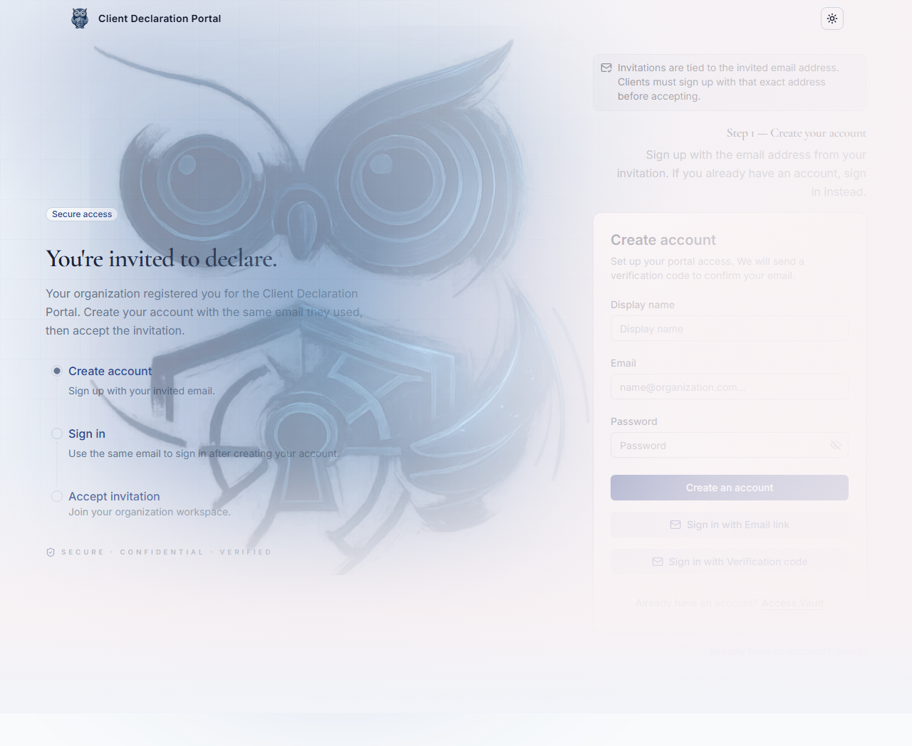
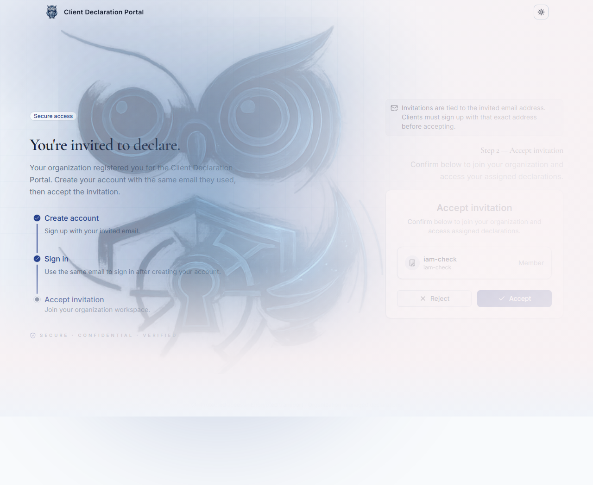
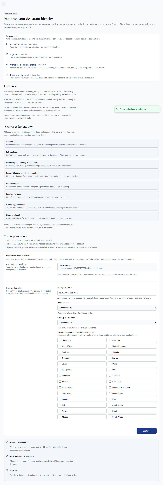
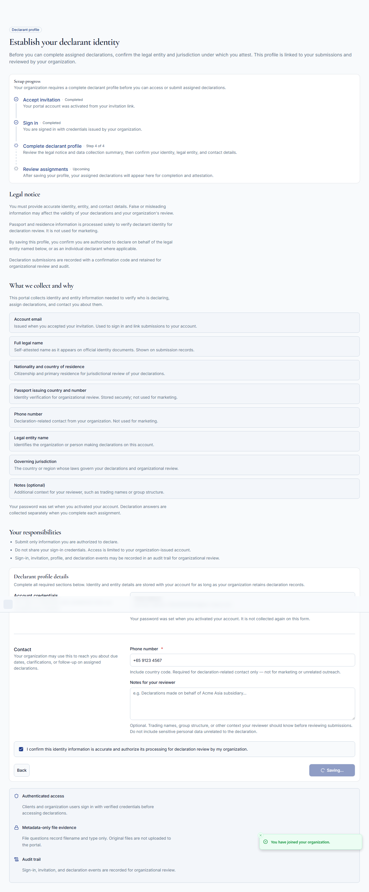
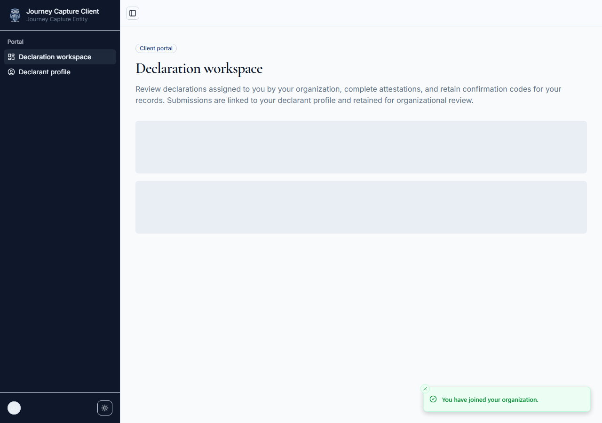

# Client invitation → declaration journey

**Audience:** operators, support, engineers  
**Environment:** production — `https://iam-check.vercel.app`  
**Last verified:** 2026-07-08 — production journey Phases 1–3 and 5–8 (Playwright `@journey` + `capture-client-journey-screenshots.mjs`)

**Related:** [BL-06](../backlogs/slices/bl-06-client-join-journey.md) · [neon-auth-validation-matrix.md](../backlogs/neon-auth-validation-matrix.md)

---

## Summary

| Phase | What happens | Verification |
| --- | --- | --- |
| 1 | Operator issues org invite → Neon email | `live-org-invite.mjs` / dashboard · `neon_auth.invitation` pending |
| 2 | Client opens `/join?invitationId=<neon_auth.id>` | PNG · sign-up shell |
| 3 | Client signs up with invited email | PNG · session created |
| 4 | Client verifies email (OTP) | **Required before accept** · Phase 4 PNG pending join-panel deploy |
| 5 | Client accepts org invitation | PNG · status → `accepted` |
| 6 | Client completes onboarding wizard | PNG · `onboardingComplete` |
| 7 | Client dashboard + acknowledgement | PNG · assignments visible |
| 8 | Client opens declaration workspace | PNG · `/client/declare/[id]` |

---

## Root cause fixed (2026-07-08)

Accept invitation returned **403** until email was verified:

```json
{
  "code": "EMAIL_VERIFICATION_REQUIRED_BEFORE_ACCEPTING_OR_REJECTING_INVITATION",
  "message": "Email verification required before accepting or rejecting invitation"
}
```

**Fix (local, not yet on `main`):** `PortalInvitationJoinPanel` routes authenticated but unverified users to `AuthView` **`email-otp`** before `accept-invitation` (`lib/client-invitation-join-auth.ts`).

**Production today:** app is live on Vercel; full journey passes when email is verified (E2E/capture scripts use `mark-neon-auth-email-verified.mjs`). Live join UI still shows **Step 2 — Accept invitation** and compact step **Sign in** — the OTP step ships after the join-panel commit is pushed and redeployed. Until then, real clients must verify at `/auth/email-otp` before accept or accept returns 403.

---

## Phase 1 — Invitation issued

**Operator:** Dashboard → Clients → Register client (or `scripts/live-org-invite.mjs`).

**Neon Auth:** `organization/invite-member` with `Origin: APP_URL` (`lib/auth/neon-auth-request.ts`).

**Email:** from `auth@mail.myneon.app` with join link containing **`neon_auth.invitation.id`** (not `client_invitations.id`).

**Verification:**

```bash
node --env-file=.env scripts/live-org-invite.mjs "client@example.com" "Client Name"
# Use joinUrl / neonAuthInvitationId from JSON output
```

---

## Phase 2 — Open join link

**URL:** `https://iam-check.vercel.app/join?invitationId=<neonAuthInvitationId>`



**Checks:** hero + step indicator + sign-up form · missing `invitationId` → error alert (no form).

---

## Phase 3 — Create account

Client submits Display name, **invited email**, password.


**Checks:** `POST /api/auth/sign-up/email` 200 · session cookie set.

---

## Phase 4 — Verify email (OTP)

Neon sends six-digit code to invited email. Client enters code on `/join` (embedded `email-otp` after deploy).


> `phase-04-verify-email.png` is not on production yet. Re-run capture after join-panel deploy; script saves this PNG when heading **Step 2 — Verify your email** appears post sign-up.

**Checks:** `session.user.emailVerified === true` before accept.

---

## Phase 5 — Accept invitation



**Checks:** `POST /api/auth/organization/accept-invitation` 200 · `neon_auth.invitation.status` → `accepted` · redirect `/client/onboarding` · audit `invite.accepted`.

---

## Phase 6 — Onboarding

Four-step declarant profile wizard at `/client/onboarding`.



**Checks:** profile saved · `onboardingComplete: true` · redirect `/client`.

---

## Phase 7 — Client dashboard

Acknowledge portal responsibilities, then view assigned declarations.



**Checks:** assignment card visible · acknowledgement recorded.

---

## Phase 8 — Declaration workspace

Client opens **Complete declaration** → `/client/declare/[assignmentId]`.



**Checks:** declaration form renders · client can submit attestation.

---

## Automated verification

```bash
npm run env:compose

# Full journey E2E (production)
PLAYWRIGHT_BASE_URL=https://iam-check.vercel.app PLAYWRIGHT_REUSE_SERVER=1 \
  npx playwright test e2e/client-invitation-journey.spec.ts --project=journey

# Regenerate runbook PNGs
node scripts/capture-client-journey-screenshots.mjs

# Unit: join auth state machine
npm run test:unit -- lib/client-invitation-join-auth.test.ts

npm run audit:neon-auth-production
```

**E2E note:** tests mark test-user email verified via `scripts/mark-neon-auth-email-verified.mjs` when OTP inbox is unavailable. Real clients must complete Phase 4 in the product.

---

## Key code

| Concern | Location |
| --- | --- |
| Join auth state (sign-up → OTP → accept) | `lib/client-invitation-join-auth.ts` |
| Join panel | `components/portal-invitation-join-panel.tsx` |
| Invite API + join URL | `scripts/live-org-invite.mjs` → `joinUrl`, `neonAuthInvitationId` |
| Bootstrap after auth | `lib/auth/bootstrap-client-invite.ts` |
| E2E flows | `testing/e2e/client-invitation-flows.ts` |
| E2E spec | `e2e/client-invitation-journey.spec.ts` |

---

## Deploy checklist (join-panel OTP routing)

- [ ] Commit and push `lib/client-invitation-join-auth.ts`, join panel/page, `lib/portal-copy.ts`
- [ ] `vercel deploy --prod --yes`
- [ ] Confirm live join shows **Verify email** (compact step 2) after sign-up: `node scripts/check-production-join-ui.mjs`
- [ ] Re-run `node scripts/capture-client-journey-screenshots.mjs` → `phase-04-verify-email.png`
- [ ] Confirm production accept works without `mark-neon-auth-email-verified.mjs`
